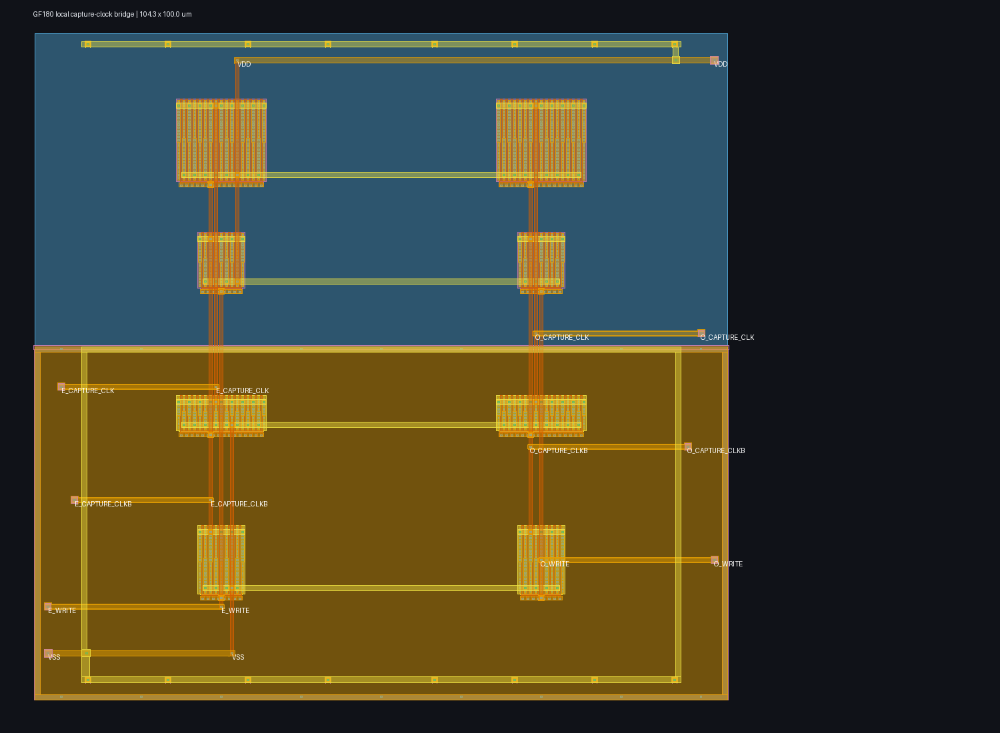

# Local PCIe capture-clock bridge

This is the intentionally small, product-specific boundary between the
dual-edge pulse generator's full-swing `E_WRITE`/`O_WRITE` outputs and the
independently clocked 2.5-GT/s capture cell.  It regenerates a complementary
clock pair locally for each interleave:

- `*_CAPTURE_CLKB` directly drives the PMOS write-gate bank.
- A locally tapered second inverter produces `*_CAPTURE_CLK` for the NFET
  write-gate bank.

This avoids treating an ideal complementary capture-clock source as part of
the lane.  It is not a general clock-tree primitive or a claim that the full
PCIe recovered-clock path is closed.

## Checked physical checkpoint

The checked-in `capture_clock_bridge.pex.spice`, `physical_result.json`, and
`pex_screen_result.json` are byte-bound.  The physical result has zero Magic
DRC errors, a unique Netgen LVS match, 96 raw extracted MOS fingers (the LVS
comparison reduces them to the eight intended logical devices), and 898 R plus
560 C full-RC parasitics.  `layout.png` is the exact rendered layout bound by
that record.

The exact bridge PEX drives the exact checked-in PEX of
`../lane/capture_2p5_fast_deserializer.pex.spice`.  With a 200 ps WRITE pulse,
the five declared public-model corners all pass: correct alternating static
capture polarity, output rails within 250 mV of each rail, no more than 125 ps
intentional complementary-entry/exit skew, and no more than 75 mA supply
current.  The limiting SS/125 C, 2.97 V case reaches 2.787/2.760 V on the
even/odd positive clocks (40 mV minimum margin to the conservative 2.72 V
screen threshold) and 118.66 ps maximum signed skew magnitude.  That is useful
local evidence, not a high-yield or signoff margin claim.

Reproduce it with `./run_physical.sh`.  The bounded run regenerates GDS,
render, DRC, LVS, full-RC PEX, and the bridge-plus-extracted-capture PVT screen;
it copies the latest artifacts into `scratch/`.  `./run_screen.sh` is only the
schematic-bridge/extracted-capture diagnostic and is not interchangeable with
the physical checkpoint.

## Deliberate limits and next product experiment

The screen uses ideal WRITE sources solely to isolate this newly physical clock
consumer. It does not prove that the pulse generator can drive the actual lane,
nor that the data-age, clock-recovery, power, substrate, mismatch, fill,
package, or EM/IR behavior of a routed lane is acceptable.

That next experiment is now recorded in
[`../pulse_bridge_lane/README.md`](../pulse_bridge_lane/README.md). Fresh pulse
PEX plus this bridge and the actual direct-regenerative lane PEX passes only
TT and SS/cold; FF/cold, FF/hot, and SS/hot collapse at the pulse WRITE output.
A direct counterfactual shows that the actual lane SENSE/BOOST PEX reproduces
the FF/cold collapse even without this bridge's capture outputs. This leaves
the bridge qualified as an isolated consumer but makes the producer/lane
interface the active PCIe circuit problem.
