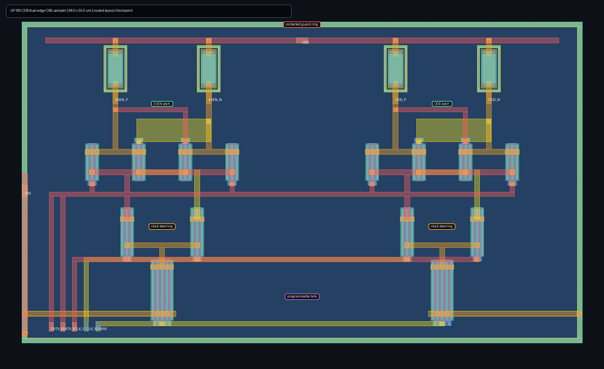

# Experimental GF180 dual-edge CDR sampler

This directory begins the `cdr` macro with the reference-assisted sampling front end required before autonomous clock recovery. Two complementary current-steering CML latches share `DATA_P/N`, a 1.25 GHz differential clock, and programmable tail bias. The even latch holds after `CLK_P` falls; the odd latch uses the swapped clock and holds after `CLK_P` rises. Together they expose raw even/odd decisions for a 2.5 GT/s stream.

Each latch steers one tail current between a differential tracking pair and a cross-coupled regenerative pair. The clock pair performs the steering below those devices, avoiding a separate large clock transistor in every signal source. Matched p-poly loads provide static CML outputs. This is a real transistor-level sampler, not the eventual Alexander decision logic or loop filter.

The current schematic matrix completes 1,701/1,701 simulations over 3 MOS corners, 3 unsalicided-resistor corners, 3 supplies, 3 temperatures, 3 shared data/clock common-mode fractions, and 7 bias settings. All 243 groups calibrate with an interior 1.00--1.30 V setting. The selected minimum signed decision margin is 0.480--1.533 V, selected current is 2.18--6.39 mA, and every group retains 3--7 electrically valid bias settings while checking 20 alternating even/odd decisions per case.

The first routed physical checkpoint is now available below. It places the even
and odd latches as mirrored halves, keeps the regenerative devices and p-poly
loads local to their outputs, locates clock steering directly below each latch,
uses compact local tail connections, and surrounds the 96 x 55 um cell with a
contacted substrate guard ring. The full-resolution PNG is intended for quick
review; `layout.tcl` remains the editable, reproducible source.

This image is a work-in-progress physical checkpoint, not signoff. The current
generated layout has eight local metal-1 spacing markers around regenerative
gate contacts, and LVS still reports connectivity/pin mismatches. DRC/LVS/PEX,
extracted aperture and setup/hold sweeps, jitter and supply sensitivity,
mismatch, metastability characterization, phase-detector logic, loop dynamics,
and autonomous acquisition remain open. Results are experimental pre-silicon
public-model evidence, not PCIe compliance or silicon qualification.
