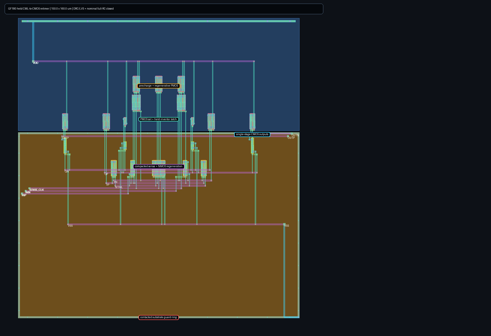

# Aperture-qualified CML-to-CMOS front end

This directory contains a routed GF180MCU development checkpoint for the
CDR-to-deserializer boundary. It is **not an analog signoff claim**. The cell
accepts a CML decision, regenerates it, and produces complementary CMOS levels
at a qualified 750 ps sampling point in each 800 ps UI. The downstream
clocked deserializer owns sampling and retention; this cell is intentionally
not another static retimer.



## Current evidence

- Schematic nominal matrix: all 6 required 200/400 mV cases and all 3
  exploratory 100 mV cases pass over 10, 25, and 50 fF loading.
- Schematic PVT smoke: 18/18 complete; all 9 representative 200 mV contract
  environments and all 9 paired 100 mV stress cases pass.
- Magic DRC: zero errors.
- Netgen LVS: circuits match uniquely, including pin names.
- Full-RC PEX: 2,048 distributed resistors and 1,340 capacitors.
- Extracted nominal matrix: all 6 contract cases and all 3 stress cases pass.
  The minimum required logic margin is 338.7 mV at the 750 ps qualification
  point; average supply current is 10.66--11.51 mA.
- Extracted PVT smoke: 18/18 simulations complete and all 9 representative
  200 mV contract environments pass. The minimum contract margin is 278.2 mV.
  Seven of nine deliberately tighter 100 mV stress cases pass. Average supply
  current is 8.74--14.96 mA, below the 20 mA cell ceiling.

The committed JSON files are the exact numeric results behind this status.
Passing this bounded smoke is a physical integration gate, not PCIe compliance
or final silicon qualification.

## Architecture and calibration

A small differential pair first acquires the CML decision on `SA`/`SB`. Those
nodes drive only second-stage gates, isolating the input from the larger reset
and regenerative capacitance on `XP`/`XN`. Separate sense and regeneration
clocks establish a 575 ps evaluation interval. Matched restoring inverters and
two-stage non-inverting buffers deliver rail-level `OUTP`/`OUTN` for the
deserializer to sample. `CAPTURE_CLK/CLKB` remain reserved interface pins and
do not control devices in this revision.

No one fixed tail size closed both ends of the 0.60--0.80 VDD input
common-mode design envelope after extraction. The layout therefore contains a
two-finger base tail plus a six-finger parallel boost tail. Assert
`SENSE_BOOST_CLK` with `SENSE_CLK` for the effective eight-finger low/mid
common-mode mode; hold it low for the two-finger high-common-mode mode. The
test flow selects boost at common-mode fractions up to 0.70. Integration must
calibrate or otherwise derive that mode from an observable; the cell does not
autonomously know its input common mode.

The generated 190 by 160 um layout contains 35 logical MOS instances. It uses
legal 0.8 um-pitch shared-diffusion fingers, explicit body ties, a contacted
substrate guard ring, matched high-metal buses, local tails, and net-aware
escape-column reuse. `layout.tcl` is the editable geometry source; the rendered
image comes from the exact GDS used for extraction.

## Reproducing the checks

Use the repository's digest-pinned `iic-osic-tools` ARM64 image and GF180MCU-D
PDK. The core in-container commands are:

```sh
magic -dnull -noconsole -rcfile "$PDK_ROOT/$PDK/libs.tech/magic/$PDK.magicrc" layout.tcl
sak-drc.sh -m -w /work/drc /work/cml_to_cmos.mag
sak-lvs.sh -m -w /work/lvs -s /src/cml_to_cmos.spice \
  -l /work/cml_to_cmos.mag -c cml_to_cmos
sak-pex.sh -m 3 -t 0 -r 1 -y 0 -n cml_to_cmos_pex \
  -w /work/pex /work/cml_to_cmos.mag
python3 run_nominal.py --source /src \
  --pex /work/pex/cml_to_cmos.pex.spice --work /work/extracted \
  --output /work/extracted.json --eval-width-ps 575 \
  --regen-delay-ps 10 --timeout-s 300
```

`run_pvt.py --waveform-dir <path>` can preserve internal acquisition,
regeneration, restoration, clock, and output nodes for selected cases. Both
runners mark 200 mV and above as the required sensitivity contract and retain
100 mV separately as exploratory stress.

## Remaining boundary

The separate 10 ps timing grid shows that all nine representative extracted
contract environments first pass together at 700 ps: worst margin is 12.9 mV
there, peaks at 439.9 mV at 870 ps, and remains 370.5 mV at 900 ps. This is a
sampled late-valid interval,
not yet a setup/hold guarantee; the deserializer closing edge and clock skew
must be composed explicitly with it.

The transistor-level deserializer now composes successfully with this full-RC
front end at 850, 880, and 900 ps closing phases in all nine representative
environments. Its own layout and extracted timing remain open. A full 729-case
extracted matrix, provider-qualified mismatch/noise and metastability-tail
analysis, post-fill extraction, EM/IR, thermal/substrate coupling, and
pad/package/board/channel co-simulation remain open.
