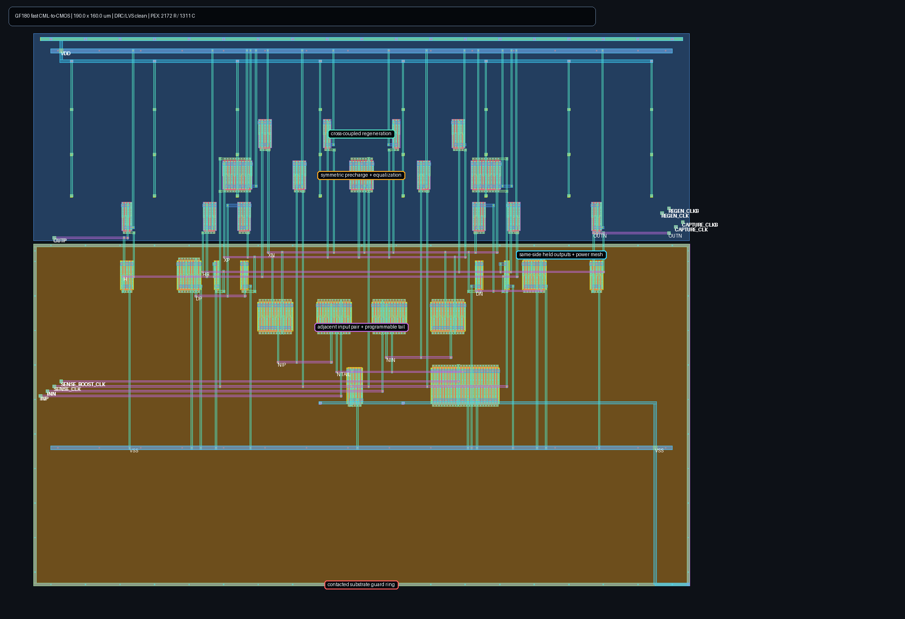

# Aperture-qualified CML-to-CMOS front end

This directory contains a routed GF180MCU development checkpoint for the
CDR-to-deserializer boundary. It is **not an analog signoff claim**. The cell
accepts a CML decision, regenerates it, and produces complementary CMOS levels
at a qualified 750 ps sampling point in each 800 ps UI. The downstream
clocked deserializer owns sampling and retention; this cell is intentionally
not another static retimer.


## Current evidence

- Schematic nominal matrix: all 6 required 200/400 mV cases and all 3
  exploratory 100 mV cases pass over 10, 25, and 50 fF loading.
- Schematic PVT smoke: 18/18 complete; all 9 representative 200 mV contract
  environments and all 9 paired 100 mV stress cases pass.
- Magic DRC: zero errors.
- Netgen LVS: circuits match uniquely, including pin names.
- Full-RC PEX: 2,048 distributed resistors and 1,340 capacitors.
- Extracted nominal matrix: all 6 contract cases and all 3 stress cases pass.
  The minimum required logic margin is 338.7 mV at the 750 ps qualification
  point; average supply current is 10.66--11.51 mA.
- Extracted PVT smoke: 18/18 simulations complete and all 9 representative
  200 mV contract environments pass. The minimum contract margin is 278.2 mV.
  Seven of nine deliberately tighter 100 mV stress cases pass. Average supply
  current is 8.74--14.96 mA, below the 20 mA cell ceiling.

The committed JSON files are the exact numeric results behind this status.
Passing this bounded smoke is a physical integration gate, not PCIe compliance
or final silicon qualification.

## Sub-400 ps replacement checkpoint

The composed 2.5 GT/s routed lane exposed a contract error in this cell: its
700--900 ps valid delay is longer than one 400 ps serial UI.  At SS/hot with
fast resistors the odd lane resolves, while the even lane has to be converted
before its sampler becomes transparent again.  Clock, offset, bias, stronger
sampler-hold, and modified-load diagnostics did not create a valid common
window; delaying conversion merely duplicated the following serial bit.

`cml_to_cmos_fast.spice` is the resulting StrongARM-style replacement. At its
measured one-lane-cycle pipeline latency, all ten representative 200 mV / 50 fF
MOS, voltage, temperature, and input-common-mode cases pass at a fixed 120 ps
qualification point. The final schematic matrix has 592.51 mV minimum logic
margin and 7.396 mA maximum average supply current.

The coded fast layout is independently zero-DRC and uniquely LVS-matched. Its
coupled full-RC extraction contains 2,172 resistors and 1,311 capacitors. The
same ten cases all pass exact PEX with 546.42 mV minimum logic margin and
9.964 mA maximum average supply current. `fast_physical_result.json` binds the
schematic, both layout-generator sources, rendered GDS, exact PEX, and timing
summary by SHA-256. This closes the fast leaf macro under its bounded public-
model contract; the routed PI/RX parent still uses the old converter until it
is regenerated and replayed.



## Legacy-cell architecture

A small differential pair first acquires the CML decision on `SA`/`SB`. Those
nodes drive only second-stage gates, isolating the input from the larger reset
and regenerative capacitance on `XP`/`XN`. Separate sense and regeneration
clocks establish a 575 ps evaluation interval. Matched restoring inverters and
two-stage non-inverting buffers deliver rail-level `OUTP`/`OUTN` for the
deserializer to sample. `CAPTURE_CLK/CLKB` remain reserved interface pins and
do not control devices in this revision.

## Fast-cell architecture and calibration

The fast circuit precharges and equalizes `XP`/`XN`, resolves through a matched
input/regeneration core, restores active-high `DP`/`DN` decisions, and writes a
weakly held cross-coupled state. A selected low dynamic node also activates a
small PMOS pull-up assist. The internal state encoding is deliberately reversed
so each active pull-down and final output inverter stays on its own physical
side; this removed the long cross-cell output-gate routes. A full-width M4/M5
power mesh with distributed vias prevents local rail resistance from being
mistaken for inadequate output-device strength.

No one tail setting closes the entire public-model envelope with the same
margin and current. The fast layout therefore contains a five-finger base tail
and a 24-finger parallel boost tail. The retained simulation policy asserts
boost only for slow-model, low/mid-common-mode cases. This demonstrates a legal
trim solution, not an autonomous calibration implementation: parent integration
must provide an observable bring-up search and store the selected trim without
using a hidden process-corner oracle.

The generated 190 by 160 um fast layout contains 29 logical MOS instances. It
uses legal one-micron escape spacing, multi-finger shared diffusion, explicit
body ties, distributed well/substrate contacts, a contacted substrate guard
ring, paired high-metal signal buses, local tails, and the symmetric power
mesh. `layout_fast.tcl` selects the fast variant and sources the common
`layout.tcl` generator; both files are hash-bound in the physical record. The
rendered image comes from the exact GDS used for extraction.

## Reproducing the checks

Use the repository's digest-pinned `iic-osic-tools` ARM64 image and GF180MCU-D
PDK. The core in-container commands are:

```sh
magic -dnull -noconsole -rcfile "$PDK_ROOT/$PDK/libs.tech/magic/$PDK.magicrc" layout.tcl
sak-drc.sh -m -w /work/drc /work/cml_to_cmos.mag
sak-lvs.sh -m -w /work/lvs -s /src/cml_to_cmos.spice \
  -l /work/cml_to_cmos.mag -c cml_to_cmos
sak-pex.sh -m 3 -t 0 -r 1 -y 0 -n cml_to_cmos_pex \
  -w /work/pex /work/cml_to_cmos.mag
python3 run_nominal.py --source /src \
  --pex /work/pex/cml_to_cmos.pex.spice --work /work/extracted \
  --output /work/extracted.json --eval-width-ps 575 \
  --regen-delay-ps 10 --timeout-s 300
```

`run_pvt.py --waveform-dir <path>` can preserve internal acquisition,
regeneration, restoration, held-state, input-branch, tail, clock, and output
nodes for selected cases. `run_fast_probe.sh` reproduces the schematic gate and
`run_fast_physical.sh` performs layout, DRC, LVS, PEX, the ten-case exact-PEX
matrix, rendering, and evidence binding inside the bounded container. Both
runners mark 200 mV and above as the required sensitivity contract and retain
100 mV separately as exploratory stress.

## Remaining boundary

The separate 10 ps timing grid shows that all nine representative extracted
contract environments first pass together at 700 ps: worst margin is 12.9 mV
there, peaks at 439.9 mV at 870 ps, and remains 370.5 mV at 900 ps. This
sampled late-valid interval is now explicitly composed with the downstream
deserializer aperture; it remains subject to unmodeled clock-distribution skew.

The routed transistor-level deserializer composes successfully with the older
full-RC front end in all nine representative environments, but that result does
not transfer automatically to the fast replacement. Regenerate the routed
parent with this exact macro and replay its PI-clocked PVT boundary next. A
denser PVT/load/input matrix, provider-qualified mismatch/noise and metastability
tails, post-fill extraction, EM/IR, thermal/substrate coupling, and
pad/package/board/channel co-simulation remain open.
