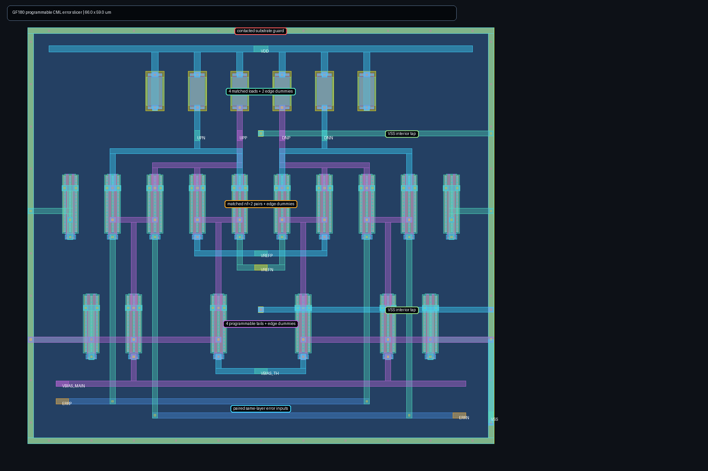

# Programmable CDR error slicer

This block converts the proportional differential output of the extracted phase-error combiner into mutually exclusive differential `UP` and `DOWN` requests. It is a real GF180 transistor circuit, not a behavioral comparator: two mirrored CML main pairs sense `ERRP/ERRN`, two matched opposing pairs establish a symmetric dead zone, and independent main/threshold tail biases make both gain and threshold calibratable on silicon. All pair and tail devices use the same unit geometry to strengthen matching; the threshold is set by current, not an unmatched device width.

The verification contract deliberately separates the observed upstream envelopes. Inputs at 40 mV or less must leave both outputs below zero, covering the composed combiner's measured 16.7 mV worst neutral residue with margin. Inputs at 150 mV and above must select exactly one output, covering the composed path's measured 151.8 mV minimum genuine error. Assertion must cross zero within 300 ps, below one 400 ps PCIe Gen1 UI. This timing bound is checked on the full-RC extracted cell across nine representative MOS/resistor/supply/temperature/common-mode environments, not inferred from transistor labels.

The final flow completes 972/972 schematic and 972/972 full-RC simulations and calibrates all 9/9 environments. Every selected setting is interior to both swept ranges: main-tail bias is 1.05--1.25 V inside 0.90--1.30 V, and threshold-tail bias is 0.65--1.00 V inside 0.50--1.05 V. Across those selected extracted settings, minimum asserted output is 54.55 mV, the largest dead-zone output is -38.53 mV, and worst assertion delay is 62.33 ps. The 66 x 59 um layout is zero-DRC and uniquely LVS-matched; coupled full-RC extraction contains 404 resistors and 139 capacitors.

The matching hardening pass compacts the signal devices to uniform 6 um pitch,
forms one mirrored load array, adds tied-off MOS and resistor edge dummies,
routes `ERRP/ERRN` on adjacent M2 rails with equal M3 gate drops/via counts, and
adds two explicitly VSS-connected interior substrate taps. The NMOS PCells are
two-finger devices. Relative to the prior sparse layout, worst extracted delay
moves only 0.376 ps (0.6%) while the geometry is substantially less vulnerable
to systematic gradients. Provider-qualified local-mismatch models are still
required to quantify offset yield. Deck-driven density/fill insertion and a
separate bias-decoupling/noise study also remain open.

A pinned, scratch-only `klayout-tools` 0.2.0 canary independently passes the
5 nm grid, zero-area, top-cell-name, and pin-label hygiene checks. Its curated
GF180 starter DRC reports zero violations on nine covered stream layers while
explicitly identifying twelve stream layers without rules; it is retained as
a secondary machine-readable audit, not a replacement for the Magic PDK deck.
The canary caught and removed an absolute-path-derived GDS top-cell name before
this release was frozen.

Run `./run.sh` for the bounded schematic calibration, symmetric layout generation, Magic DRC, unique Netgen LVS, full coupled-RC extraction, extracted calibration/timing sweep, and annotated layout render. Results are pre-silicon evidence from the public GF180 model set; they are not foundry qualification or measured silicon data.
