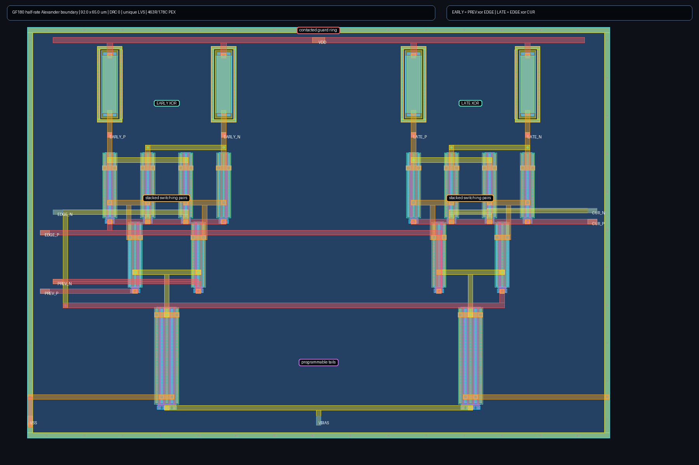

# Experimental GF180 half-rate Alexander phase-detector boundary

This block implements one Alexander boundary from three differential sampler
decisions. Two stacked CML XOR cells produce `EARLY = PREV xor EDGE` and
`LATE = EDGE xor CUR`. A complete half-rate CDR uses the corresponding
interleaved boundaries and consumes these raw outputs in the loop filter; this
cell is the transistor-level phase-comparison primitive, not a complete CDR.

Each XOR uses a differential lower selector, crossed upper differential pairs,
matched unsalicided p-poly loads, and a programmable shared tail-bias voltage.
The 0.45--1.15 V search range uses 50 mV candidate spacing in simulation. The
eventual bias generator and calibration controller must implement and retain
the selected setting; programmability does not make calibration automatic.

The schematic and extracted evidence matrices check both Boolean equations at 1.25 Gupdates/s
per interleaved half-rate boundary, corresponding to a 2.5 GT/s stream. It uses
20 ps input edges, 280 mV differential inputs, 25 fF on each output, three MOS
corners, three resistor corners, 2.97/3.30/3.63 V supplies, -40/27/125 C, and
0.60/0.70/0.80 supply-scaled input common-mode. All 3,645 extracted simulations
complete and all 243 environments calibrate. The selected extracted bias range
is 0.55--1.00 V and selected-code signed output margin is 171--610 mV.

The compact 92 x 65 um layout places each pair of local loads above adjacent
stacked switching devices, puts each tail directly below its selector, uses
matched upper-metal differential routing, and surrounds the cell with a
contacted substrate guard ring. Magic reports zero DRC errors, Netgen reports a
unique LVS match, and coupled full-RC extraction contains 463 resistors and 178
capacitors.



After calibration, a second extracted suite holds one bias code fixed in each
of nine representative environments. All 360 simulations complete. Its 243
gating cases pass: the normal PVT contract requires at least 100 mV signed
margin; independently guardbanded 200--400 mV differential input, 10--50 fF
load, 1.0--1.5 Gupdates/s, 20--100 ps edges, and 50 mV-peak supply ripple
require at least 75 mV; and the stacked 1.5 Gupdates/s/100 ps/200 mV/50 fF case
requires at least 50 mV. The observed worst stacked margin is 59.8 mV. Of 117
non-gating exploratory cases, 93 retain 100 mV, including six of nine 2x
overspeed environments; the failures are retained as boundary evidence.

Run the bounded, digest-pinned reproduction with:

```sh
make cdr-phase-detector-smoke
```

The quicker schematic-only matrix remains available as
`make cdr-phase-detector-schematic`.

This is public-model pre-silicon evidence for one phase-comparison primitive.
Paired-boundary integration, sampler loading, mismatch, loop dynamics,
independent-simulator correlation, foundry signoff, and PCIe compliance remain
open; no silicon-performance claim is made.
