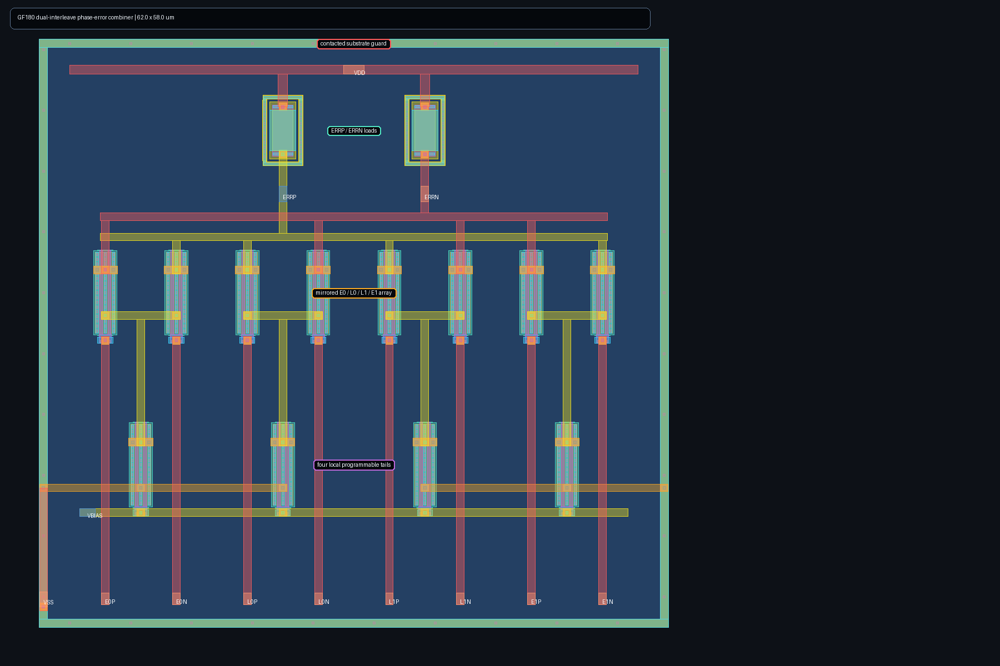

# Experimental CML phase-error combiner

This block is the first analog loop-control boundary after the two interleaved
Alexander detectors. Four matched CML pairs sum `EARLY0/LATE0` and
`EARLY1/LATE1` into a differential error voltage. One EARLY vote drives
positive error, one LATE vote drives negative error, two agreeing votes double
the magnitude, and neutral or opposed votes cancel.

The output is deliberately a proportional, externally loaded observable. It
does not yet claim acquisition, integral loop filtering, retiming, or a stable
closed CDR loop. Those require composition with the detector valid windows,
phase-interpolator control, and the eventual PLL clock path.

The generated 62 x 58 um GF180 cell uses a mirrored `E0/L0/L1/E1` input
array, four tails directly beneath their local pairs, centered differential
loads, separate upper-metal summing rails, and a contacted substrate guard.
It is Magic DRC-clean, matches the schematic uniquely in Netgen LVS, and its
full-RC extraction contains 330 resistors and 133 capacitors.



Both schematic and full-RC matrices complete 108/108 simulations and calibrate
all nine representative process/passive/supply/temperature/common-mode
environments. Extracted selected single-vote margin is 0.342--0.712 V,
two-vote margin is 0.681--1.371 V, neutral/opposed residual is at most 16.7 mV,
and selected bias is 0.75--1.05 V. Reproduce the complete physical flow with:

```sh
make cdr-phase-error-filter-smoke
```

These results qualify a signed proportional error boundary, not a direct
phase-interpolator control voltage. A realizable controller must still retime
the votes, integrate or digitally accumulate them, clamp the control range,
and demonstrate closed-loop stability and acquisition.
