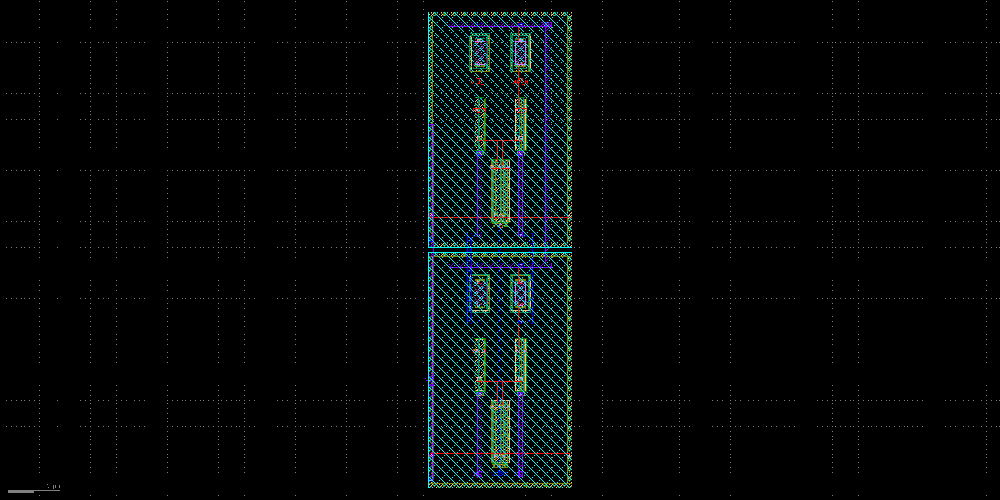
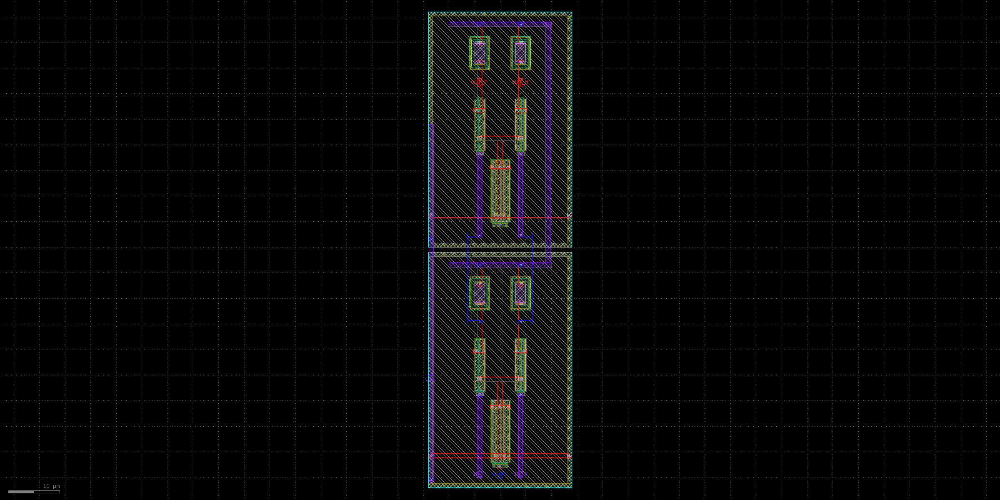

# Extracted RX data restorer

This directory contains the dedicated two-stage static-CML limiter between the
receiver amplifier and dual-edge sampler. It was added after combined
PVT/channel/timing/supply composition showed that the receiver could produce
correct final bits while violating the sampler's independently qualified
200 mV differential-input assumption.



The 2.5 GT/s lane uses a separately generated fixed geometry rather than
forcing one compromise cell across both rates:



Each stage uses a matched 20 um-per-side NMOS input pair, a local 48 um tail,
and adjacent 4.5 um by 2 um unsalicided p-poly loads. The two stages have
independent contacted guards, short local source/tail nodes, and symmetric
parent-owned interstage routing. The 4.5 um loads are a measured compromise:
the reused 7.5 um clock limiter retained wrong-bit history on PRBS data, while
the first 4.0 um data version left only a few millivolts of fast-resistor gain
margin.

Run the bounded physical flow with:

```sh
./ip/blocks/analog/wireline_serdes/data_restorer/run.sh
```

The selected layout has zero Magic DRC errors, a unique pin-resolved Netgen LVS
match, and a full-RC extraction containing 366 resistors and 92 capacitors. The
checked-in PEX and physical record are byte-bound. `layout.png` is rendered
from the same generated GDS geometry.

For the first 2.5 GT/s lane milestone, `cml_data_restorer_2p5` keeps the same
matched 20 um-per-side inputs and 48 um tails but shortens each p-poly load
from 4.5 to 3.6 um. That released physical variant remains immutable because
the nominal, PVT, and pre-calibration records bind its exact PEX.

The combined-stress capture closure uses the separately named
`cml_data_restorer_2p5_calibrated` cell and
`data_restorer_2p5_calibrated.spice`. Its 4.2 um loads recover the `ss/res_ff`
gain floor without changing the matched topology or the earlier release. The
generated layout is zero-DRC, uniquely LVS-matched, and extracts to 366
resistors and 92 capacitors. `layout_2p5_calibrated.png`, the PEX, and
`physical_2p5_calibrated_result.json` are byte-bound to the five-environment
combined-stress simulation.


The exact PEX is qualified in the complete 1.25 GBd lane, not by a standalone
gain claim. At the limiting slow/passive environment, sampler phases 67.5 and
90 degrees both pass under simultaneous channel, jitter, duty-cycle, and rail
ripple stress; the selected 78.75 degree phase lies between them. The final
five-environment matrix uses restorer bias codes 1.2--1.4 V and retains at
least 230.118 mV signed sampler-input margin and 2.80740 V final CMOS margin.

This is public-model pre-silicon evidence. Mismatch, extracted parent routing,
selected pads/package/channel, PDN/substrate aggression, post-fill extraction,
EM/IR, provider review, and measured-silicon calibration remain open.
