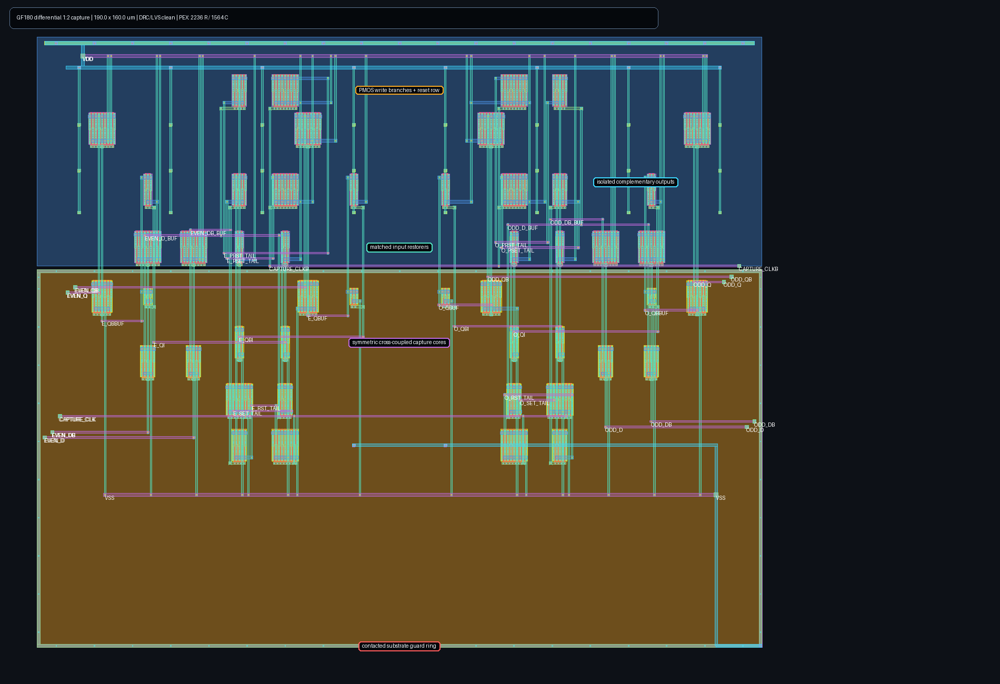

# Differential half-rate capture stage

This directory contains the transistor-level and routed `deserializer` child
of the GF180 wireline SerDes. It captures complementary CMOS decisions from
the CDR front end, retains even and odd bits across the following acquisition,
and exposes complementary parallel outputs. The result is experimental
pre-silicon evidence, not a hardened PCIe macro or compliance claim.

Each lane first restores `D/DB` through matched inverters, isolating the
dynamic CML-to-CMOS outputs from the larger write-device gate capacitance. The
inverted rails are crossed back into the capture core to preserve polarity.
Complementary NMOS and PMOS write branches then force opposite nodes of a
symmetric cross-coupled static latch while `CAPTURE_CLK/CLKB` are active.
Both capture-clock phases therefore have a real circuit function. A weaker
`m=2` latch avoids slow-corner write contention, while `m=4` data devices and
`m=8` clock switches retain push-pull write authority. Tapered output buffers
isolate retained state from four external loads.

## Routed layout

`layout.tcl` generates a 190 x 160 um, 48-device dual-lane layout with mirrored
even/odd signal paths, explicit well/body ties, a contacted substrate guard
ring, and high-metal buses. The generated cell has zero Magic DRC errors and
matches `deserializer.spice` uniquely in Netgen LVS. Its full-RC extraction
contains 2,236 resistors and 1,564 capacitors and has SHA-256
`6230fc420f4cec8173c4df3080be4cdac422627eb4af7beabdaadec02fd109e9`.
The PNG below is rendered from that exact GDS; `layout.tcl` remains the editable
source. `physical_result.json` binds the source, GDS, PEX, and image hashes to
the DRC/LVS and parasitic-count summary.



## Executable evidence

The final schematic timing matrix runs 72 simulations over nine representative
MOS/supply/temperature environments, 680 and 700 ps data-ready times, 10 and
50 fF output loads, and 950 and 1000 ps capture closes. All 72 complete and all
36 environment/readiness/load groups pass. Both closes are common across the
schematic groups, minimum signed logic margin is 593.0 mV, and two-lane average
supply current is 3.65--5.86 mA.

The full extracted matrix repeats all 72 readiness/load/environment cases.
All 72 complete and all 36 timing groups have a passing close; 1000 ps is the
common extracted close. Minimum passing logic margin is 52.8 mV and two-lane
average current is 5.13--7.62 mA.

The composition matrix replaces ideal inputs with the actual full-RC
CML-to-CMOS extraction, retains 50 fF on both front-end rails and all four
captured outputs, and uses 200 mV differential input. Both cells are extracted.
All 18 simulations complete and all nine representative process, voltage,
temperature, and common-mode environments pass at one or both late closes;
1000 ps is common to every environment. Minimum passing output margin is
115.9 mV, and combined front-end plus two-lane capture current is
15.23--24.82 mA. The compact result records both extracted-netlist hashes.

Run the bounded evidence flow in the pinned GF180 container with:

```sh
python3 run_capture.py --source /src --pex /pex/deserializer_1to2.pex.spice \
  --work /work/capture --output /work/capture.json --jobs 4 \
  --capture-close-ps 950 --capture-close-ps 1000 --output-settle-ps 380
python3 run_integrated.py --source /src \
  --frontend-pex /front/cml_to_cmos.pex.spice \
  --deserializer-pex /pex/deserializer_1to2.pex.spice \
  --work /work/integrated --output /work/integrated.json --jobs 4 \
  --capture-close-ps 950 --capture-close-ps 1000 --output-settle-ps 380
```

The scripts reject a close-plus-settle time beyond 1.38 ns, ahead of the next
capture opening at 1.4 ns. The late phase is therefore a bounded timing budget,
not a result sampled after the following acquisition begins.

## Remaining boundary

This closes the routed CML-to-CMOS-to-parallel-data boundary over the declared
representative deterministic matrix. Mismatch/metastability tails using a
provider-qualified statistical model, capture-clock jitter and duty-cycle
distortion, coupled supply/substrate injection, EM/IR, density fill and
post-fill extraction, pad/package/channel co-simulation, and independent
simulator correlation remain open. The next functional integration step is
the parallel RX path and autonomous CDR timing/control composition.
