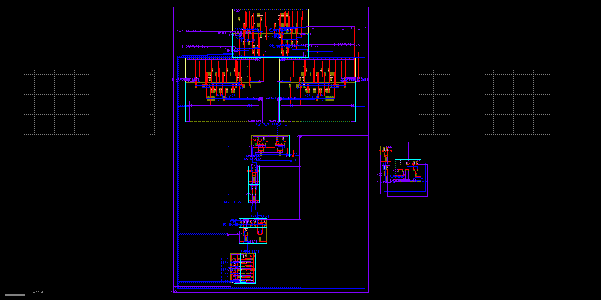

# Routed PI-to-RX capture parent

This parent places the extracted phase interpolator and a two-stage CML clock
restorer beside the routed termination/RX/restorer/sampler/converter/capture
hierarchy. It owns the differential clock routes into both sampler latches.
The retained baseline layout is zero-DRC, uniquely LVS-matched, and full-RC extracted
to 8,625 resistors and 5,034 capacitors. The physical checker also requires the
schematic and extracted SPICE port orders to match exactly.

The direct PI-to-sampler experiment failed because the PI's former 50 fF load
did not represent four nonlinear 8 um x m2 sampler clock gates. The extracted
PI -> two-stage restorer -> dual sampler chain passes 4/4 restorer-bias points.
At the selected 1.15 V restorer bias it produces about +2.19/-2.19 V
differential clock extrema; the measured rising edge is 312.65 ps after the A
input's rising edge for equal PI controls.

The former smoke failure was caused by observing the output while the capture
write pulse was still active. With a 550 ps event-relative opening, 380 ps
write pulse, and 1050 ps observation, the capture has 120 ps to regenerate and
300 ps before its next same-lane opening. The exact parent passes a 24-bit
PRBS7 at adjacent 200 and 300 ps conversion offsets in an eight-point nominal
screen. The selected 200 ps case retains 98.071 mV raw-RX, 367.009 mV restored,
671.376 mV sampler, 400.615 mV converter, and 1.5155 V final-capture margin at
50.815 mA. Restored-clock rise/fall times are measured directly in every case.

The baseline does not close PVT. Corrected per-lane qualification and write-time
scoring passes 3/5 exact-parent environments: TT, FF/cold, and SS/passive.
FF/hot reaches 199/221 mV worst signed write margin on the two lanes, with one
polarity wrong, despite 932 mV/2.048 V final held outputs. SS/hot is weaker:
the even converter reaches only 57 mV at qualification and 61 mV at write,
then both final outputs remain within 10 mV of an invalid decision. Clock-edge
skew, larger sampler loads, tail boost, and independent lane delays were useful
diagnostics but did not produce a common correct window. Delaying the even
conversion by 400 ps makes its output strong only by capturing the same serial
bit as the odd lane. The physical converter's 700--900 ps useful window is
therefore structurally incompatible with a 400 ps serial UI at this boundary.

The versioned fast parent now replaces both converters and carries the new
child power mesh through a minimally rerouted hierarchy. It is independently
zero-DRC, uniquely LVS-matched, and full-RC extracted to 8,717 resistors and
4,874 capacitors. Its 24-bit PRBS7 exact-parent replay includes a 6 ohm/leg plus
1 pF channel proxy, 30 ps peak clock jitter, 47% duty, and 20 mV/100 MHz rail
ripple. TT, FF/cold, FF/hot, and SS/passive pass. The limiting passing final
capture margin is 685.201 mV in FF/hot; its 22.95 mV dynamic sampler overshoot
is inside the explicit 50 mV bound. SS/passive retains 2.10493 V final margin
and closes its write window at 780 ps, 20 ps before the next same-lane event.

SS/hot remains a completed failure. The even lane carries the requested word
at latency zero while the odd lane carries it at latency one; each lane can be
correct individually, but no common integer data age makes both correct.
Independent converter skew, PI phase, odd sense width, and per-lane tail-boost
screens did not create a non-overlapping common window. This is a concrete
retiming/scheduling boundary rather than permission to select different
latencies in the checker. `fast_capture_pvt_result.json` preserves the 4/5
checkpoint and all five individual evidence records are hash-bound by
`check_fast_checkpoint.py`.

Run `./run_physical.sh` for the baseline layout/DRC/LVS/PEX and
`./run_fast_physical.sh` for the versioned fast parent. Use `./run_clock_chain.sh` and
`./run_clock_chain_ss.sh` for nonlinear clock-load checks, and the lane
`run_capture_2p5_rx_pi_fast_smoke.sh` or
`run_capture_2p5_rx_pi_fast_pvt.sh` for the fast composed transients. Generated
logs and waveforms remain in scratch; the committed JSON records bind the exact
parent PEX, physical record, testbench, and runner. The lane's `*_scan.sh`
runners preserve the even-skew, PI-phase, odd-sense/boost, and non-overlapping
capture-window experiments; `summarize_capture_scan.py` is the shared compact
evidence combiner for these independently simulated calibration points.
