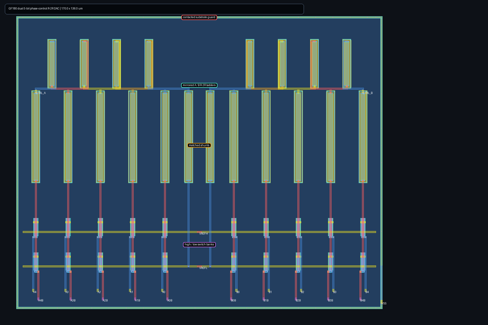

# GF180 phase-interpolator control DAC

This directory contains the physically extracted control source for the CDR
phase interpolator: two independent five-bit voltage-mode R-2R DACs.  Digital
calibration supplies each bit and its complement, and may retain an arbitrary
`CTRL_A`/`CTRL_B` pair for every phase code.  The two sides are deliberately
independent because equal phase spacing is a nonlinear, PVT-dependent function
of both phase-interpolator tail controls.



The generated 170 x 136 um layout uses mirrored A/B ladders, equal resistor and
switch geometry, separate reference rails, upper-metal ladder/output routes,
and a contacted substrate guard.  It is Magic DRC-clean, uniquely matches the
schematic in Netgen LVS, and its full-RC extraction contains 640 resistors and
265 capacitors.

Run the bounded standalone closure with:

```sh
make phase-control-dac-smoke
```

Both schematic and extracted DC matrices complete 288/288 cases and pass all
9/9 representative mixed MOS/resistor/supply/temperature environments.  The
extracted ladder has at least 21.808 mV between adjacent codes, reaches at least
1.29694 V at code 31, and consumes at most 0.437419 mW from its 1.333/0.300 V
references.  The extracted worst 15-to-16 carry transition settles into 250 fF
in 1.21035 ns across 9/9 environments.  That settling time is a calibration-loop
constraint, not a 400 ps PCIe datapath delay.

The DAC does not calibrate itself.  Integration needs a phase observable, a
search/controller, retained code storage, reference generation, and reset-safe
digital levels.  Public GF180 models, zero DRC, unique LVS, and extracted
simulation are pre-silicon evidence—not density/antenna/ERC, EM/IR, reliability,
provider signoff, or measured-silicon qualification.
