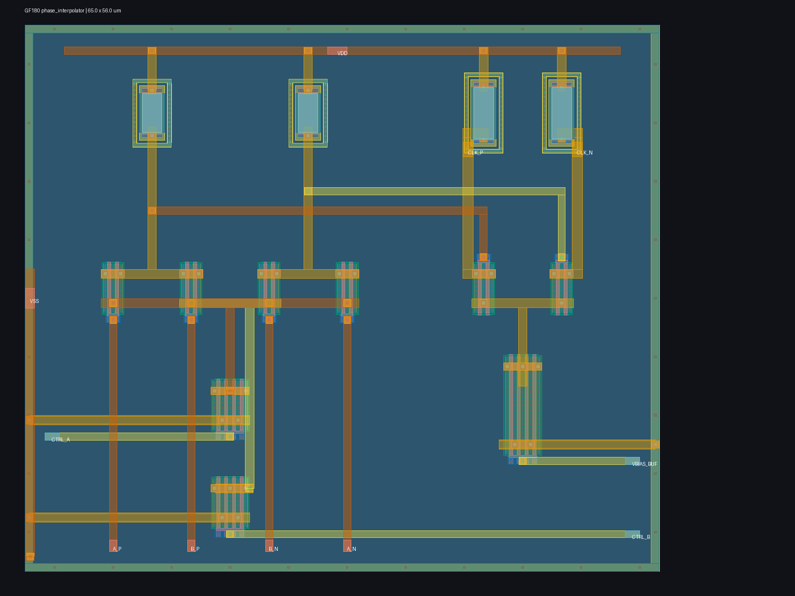

# Experimental GF180 CML phase interpolator

This directory contains a transistor-level two-input CML phase interpolator for the reference-assisted 2.5 GT/s sampling milestone. Two adjacent 1.25 GHz differential reference phases drive matched current-steering pairs; `CTRL_A` and `CTRL_B` select their relative tail currents, and a local CML buffer isolates the summed node from the sampling-clock load.



`layout.png` is a directly usable 1600 x 1200 rendering of the generated 65 x 56 um GDS. The A/B input devices form an equal-centroid quartet at left, the programmable tail devices sit directly below them, the restoring buffer is at right, and the perimeter includes explicit substrate contacts. Signal, source, and control routes use separate upper-metal tracks where crossings require them.

The current physical checkpoint is Magic DRC-clean, matches the transistor-level schematic uniquely in Netgen LVS, and has a coupled full-RC extraction containing 356 resistors and 137 capacitors.

Run the bounded reproducible evidence flow with:

```sh
make phase-interpolator-smoke
```

The characterized search uses 31 ordered `CTRL_A`/`CTRL_B` voltage pairs, fitting in a five-bit DAC table with one spare code. Independent schematic and full-RC sweeps each cover 3 MOS corners, 3 unsalicided-resistor corners, 3 supplies, 3 temperatures, 3 input common-mode fractions, and every control pair. Both complete 7,533/7,533 simulations and calibrate 243/243 groups to five target phases. Across extraction, phase span is 198.90--200.17 ps, worst calibrated error is 7.50 ps, minimum differential magnitude is 202.0 mV, and supply current is 1.70--4.66 mA.

An additional 279 extracted simulations pass 9/9 stress groups spanning 1.0--1.5 GHz reference clocks, 100--300 mV input amplitude, 25--100 fF output load, and 75--105 degree input quadrature. The common-mode check is expressed as waveform headroom: the differential peaks must remain at least 250 mV above ground and 100 mV below VDD. This avoids rejecting a valid large-swing low-common-mode waveform while still enforcing device and sampler headroom.

The analog controls provide calibration range for unknown silicon, temperature, supply, and extracted-interconnect behavior. They do not determine their own settings: integration still needs a phase detector or reference measurement, a calibration search, and retained control codes.

This is pre-silicon public-model evidence, not a PCIe-qualified clocking macro. It still needs statistical mismatch with provider-approved models, supply-noise/jitter sensitivity, clock-tree and sampler co-simulation, post-fill extraction, EM/IR and reliability review, and silicon correlation before freeze.
