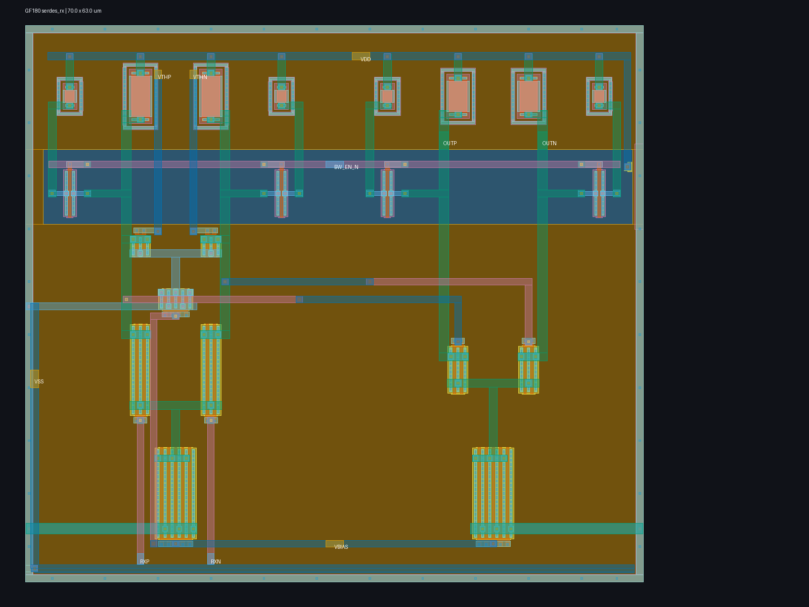

# Experimental GF180 static CML receiver core

This directory contains a two-stage static-NMOS CML receiver core for externally clocked 1.25 and 2.5 GT/s wireline operation. The first stage combines a matched differential input pair with a smaller differential threshold-trim pair. Both stages have active-low switched load branches for a high-bandwidth mode, and a shared programmable tail-bias input selects a usable operating point after process, voltage, and temperature variation.



`layout.png` is a directly usable 1600 x 1200 rendering of the generated 70 x 63 um GDS. The first stage is at left and the second stage at right, with paired load structures above, local tail devices below, separated control/signal metals, explicit well/body contacts, and a continuously contacted substrate guard. The second-stage input devices are deliberately smaller than the input pair to reduce first-stage gate loading and output diffusion capacitance.

Run the bounded reproducible evidence flow with:

```sh
make serdes-rx-smoke
```

The flow uses a digest-pinned ARM64 GF180 image with CPU, memory, PID, timeout, network, and free-space guards. It sweeps 3 MOS corners, 3 unsalicided-resistor corners, 3 supplies, 3 temperatures, 3 input common-mode fractions, 2 bandwidth modes, and 7 candidate bias voltages. It then verifies differential threshold control and 200 mVpp minimum-input transients at every calibrated group, regenerates MAG/GDS, requires clean Magic DRC and unique Netgen LVS, performs coupled full-RC extraction down to 1 mOhm, repeats the electrical matrices on the extraction, integrates nominal differential noise from 1 MHz through 20 GHz, and renders the actual GDS.

The core input common-mode range is deliberately limited to 0.45--0.55 of VDD. This is an AC-coupled, internally biased analog core, not a pad-level rail-to-rail receiver. Low/high modes require at least 1.5/2.0 GHz extracted bandwidth and 0.90/0.55 V/V gain at 1.25 GHz; the lower extreme-corner gain is accepted only together with the explicit 200 mVpp transient sensitivity test. Typical extracted bandwidth is materially stronger than these worst-corner floors.

The current full-RC matrix completes 3,402/3,402 AC simulations and calibrates 486/486 PVT/common-mode/mode groups using an interior 0.95--1.35 V bias choice. Selected extracted bandwidth is 1.756--2.701 GHz in low mode and 2.138--3.355 GHz in high mode. The corresponding 486 extracted transients all pass: minimum differential output magnitude is 52.95 mV, worst crossing delay is 108.53 ps, and worst polarity-magnitude asymmetry is 3.54 mV. The extraction contains 442 distributed resistors and 169 capacitors.

Threshold verification adds 1,458 schematic and 1,458 extracted DC transfer sweeps. Every extracted group retains at least 35.96 mV trip movement in either direction; the worst zero-command input offset is 1.283 mV. Nominal extracted integrated input-referred noise is 1.12--1.32 mV RMS from 1 MHz through 20 GHz. Magic reports zero DRC errors and Netgen reports a unique LVS match.

The `VTHP`/`VTHN` auxiliary pair is a differential threshold control, not a calibration algorithm. The full-RC layout is allowed up to 1.5 mV zero-command input offset because that offset is precisely what this control must null; threshold drive must still move the trip point at least 25 mV in either direction. Likewise, `VBIAS` and `BW_EN_N` provide correction choices for unknown silicon and interconnect behavior, but integration logic must measure a reference condition and retain appropriate settings. Programmability supplies range; it does not discover the correct code by itself.

All results are experimental pre-silicon public-model evidence. The cell is not a complete PCIe receiver and is not compliance-qualified. It still needs the selected pad/ESD structure, package and channel extraction, termination co-simulation, device mismatch/Monte Carlo with provider-approved statistical models, post-fill extraction, EM/IR and reliability review, a concrete calibration observable/algorithm, clock/data recovery and sampling, behavioral interoperability testing, and silicon correlation before analog-top freeze.
