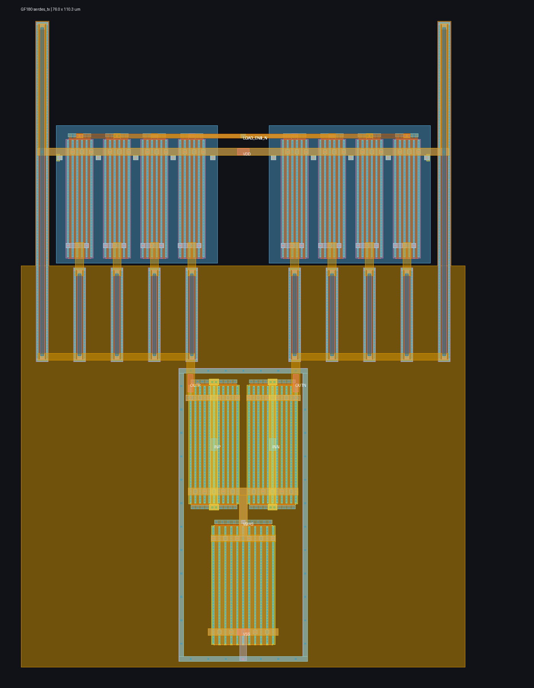

# Experimental GF180 CML transmitter

This directory contains a real transistor-level differential transmitter cell, not a behavioral placeholder. Mirrored salicided p-poly load banks feed a matched 10-finger NMOS differential pair and a 10-finger NMOS tail-current device. Each side has a 56 um always-on resistor and four active-low, PMOS-switched 14 um trim branches. The common thermometer code changes load resistance while `VBIAS` changes tail current; the nominal three-branch, 1.25 V point is selected from extracted simulation rather than assumed from schematic-only current.



`layout.png` is a directly usable raster rendering of the generated GDS: the mirrored trim banks and their long outer base resistors are at the top, the adjacent differential pair is in the middle, and the centered tail device and contacted substrate guard ring are at the bottom.

`layout.tcl` generates and routes GF180 parameterized devices, places the pair banks adjacently with distributed gate contacts, puts the tail directly beneath the shared-source rail, keeps the matched output trunks on metal3 at the outer drain edges, adds redundant via transitions, explicit PMOS well taps, and a continuously contacted substrate guard ring, labels the eleven interface pins, and emits MAG/GDS into disposable scratch. The bounded flow runs bias characterization, pre-layout ngspice, Magic DRC, Netgen LVS, full coupled-RC extraction down to 1 mOhm, extracted ngspice at 1.25 and 2.5 GT/s, and an actual GDS render.

Run it with:

```sh
make serdes-tx-smoke
```

Passing nominal evidence is written to `scratch/serdes-tx-last.json`; the inspected layout image is `scratch/serdes-tx-layout-last.png`. `run_programmable_pvt.py` separately searches load code and bias over MOS, resistor, voltage, and temperature corners using either schematic or full-RC extracted netlists. These are experimental pre-silicon public-model results. They are not PCIe compliance, package/channel, reliability, or foundry qualification evidence; the pad/ESD boundary is still unmodeled.
