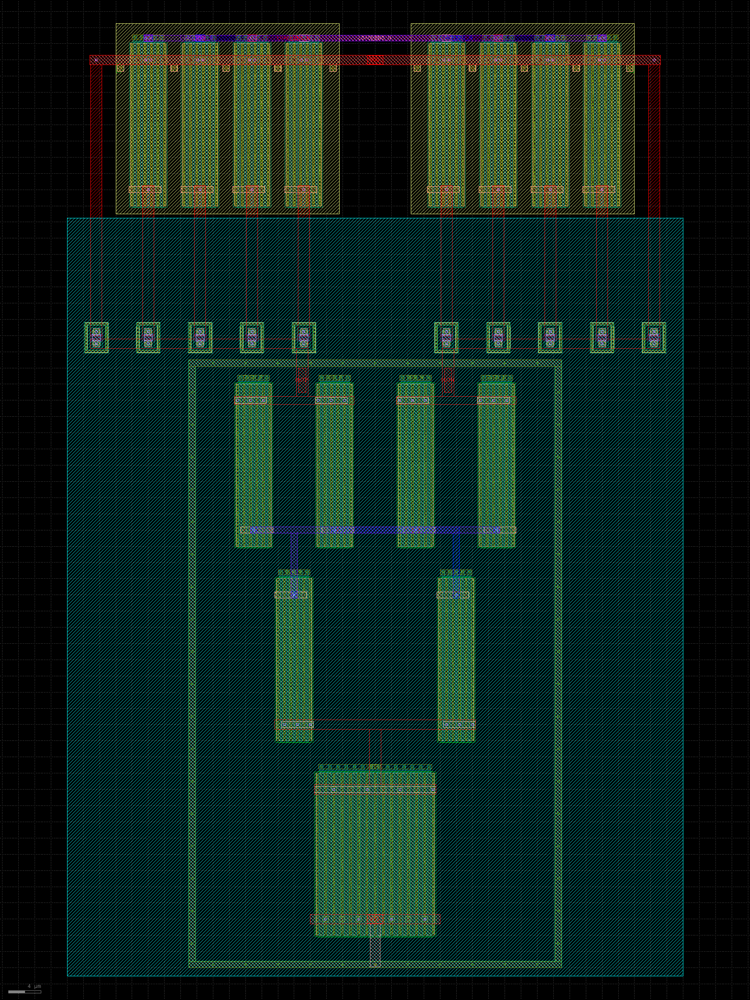

# Half-rate serializer

This directory contains two differential half-rate TX experiments.  The first
is a standalone 2:1 CML serializer.  The selected product topology instead
integrates the EVEN/ODD clock steering into the programmable TX output stage,
eliminating the high-capacitance serializer-to-driver gate boundary exposed by
the changing-word tests.

The generated 48 by 55 um layout is mirror symmetric, uses an
`E_P/O_P/O_N/E_N` equal-centroid data array, puts both loads directly above the
output drains, places both clock selectors and the tail immediately below the
data array, and includes distributed substrate contacts and a contacted guard
ring. The checked physical result has zero Magic DRC errors, one unique
pin-resolved Netgen LVS match, and a 267-resistor/85-capacitor full-RC
extraction.

At the diagnostic 1.25 GBd rate, 36/45 extracted bias cases pass and a
realizable setting exists in all five process/passive/supply/temperature
environments. Selected settings produce at least +/-0.72 V at the serializer
boundary, no more than 56.92 ps serializer-to-TX delay, and 0.774--1.334 mA
serializer current. The harder 2.5 GT/s stress also closes 5/5 environments
after widening the tail-bias search: 21/45 cases pass, with selected settings
from 0.9 to 1.5 V, at least +/-0.60 V serializer swing, at most 50.77 ps delay,
and at most 2.006 mA serializer current. These are public-model pre-silicon
claims, not PCIe compliance evidence.

The standalone cell does not qualify arbitrary parallel traffic.  When each
EVEN and ODD lane changes only during its unselected UI, its extracted output
must discharge and recharge the large TX gate bank; the direct boundary barely
closes at 1.25 GT/s with a high bias and fails at 2.5 GT/s.  Schematic output
buffers and reuse of the PLL clock restorer did not recover every slow/hot
environment.  These failures select the integrated topology rather than being
hidden by the older static alternating-word result.

`serializer_tx.spice` and `integrated_tx_layout.tcl` implement the selected
clock-steered TX.  Four equal-centroid data banks share the real programmable
load/output nodes; local clock selectors and one tail sit immediately below
them.  The generated layout is approximately 76 by 116 um, has zero Magic DRC
errors and one unique pin-resolved Netgen LVS match, and extracts to 1,081
resistors and 614 capacitors.  Exact PEX passes all 35 changing-word aperture
cases in all five process/passive/supply/temperature environments at each
rate.  At 1.25 GT/s it selects 0.9--1.3 V bias, retains at least 0.56308 V
signed center margin and draws 4.906--7.225 mA.  At 2.5 GT/s it selects
1.1--1.6 V, retains at least 0.5289654 V and draws 8.555--10.125 mA.  Both
matrices include seven update offsets with at least 60 ps setup and hold.

Run `./run_schematic.sh` for the bounded schematic/load sweep and
`./run_physical.sh` for layout generation, DRC, LVS, PEX, and both extracted
rate matrices of the standalone test structure.  Run `./run_integrated_tx.sh`
for the selected topology's bounded schematic aperture matrix and
`./run_integrated_tx_physical.sh` for layout, DRC, LVS, PEX and both exact-PEX
changing-word matrices.  Clock jitter and duty distortion, mismatch, a
realizable bias DAC, pad/ESD/package loading and full-lane PRBS remain open.
