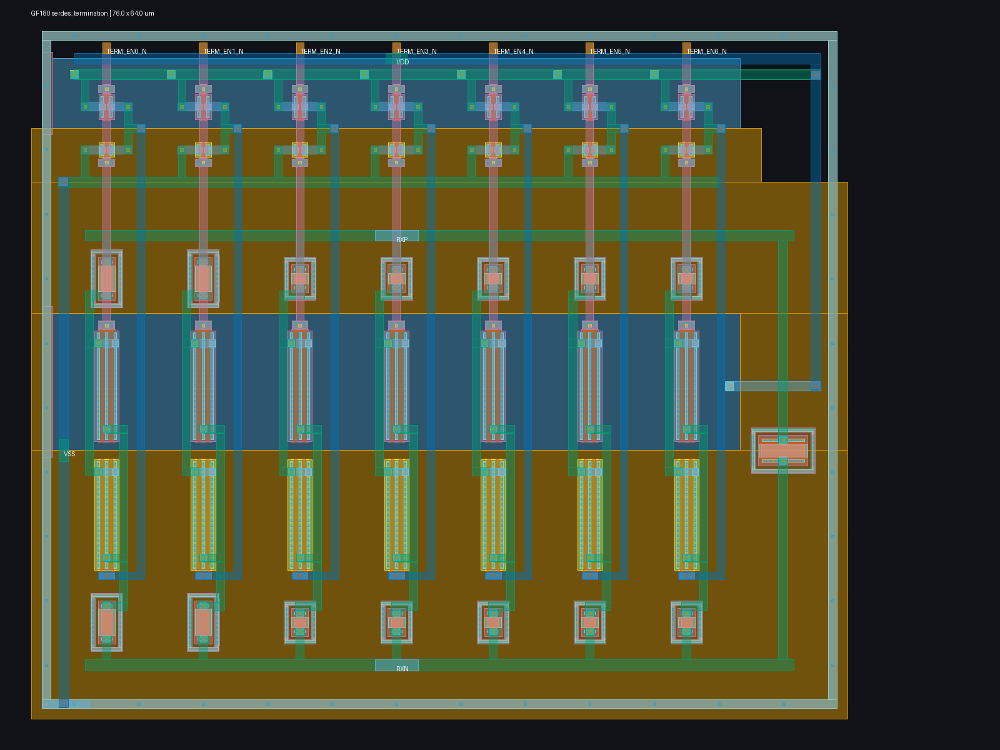

# Experimental GF180 programmable differential termination

This directory contains a transistor-level, seven-branch differential termination intended for receiver-side calibration around 100 ohms. A wide unsalicided p-poly base resistor is always present. Seven symmetric p-poly branches can be added in thermometer order through midpoint CMOS transmission gates; the two fine branches use longer resistors and the five coarse branches use shorter resistors. Active-low control pins are converted locally so both halves of each transmission gate receive complementary drive.



`layout.png` is a directly usable 1600 x 1200 raster rendering of the generated 76 x 64 um GDS. The seven matched vertical branch columns share short metal3 `RXP` and `RXN` buses, their local inverters sit above the signal devices, a separate base resistor is at right, and the cell is surrounded by a continuously contacted substrate guard. Analog branch paths and control trunks use separate metal layers; well and body connections are explicit.

Run the bounded, reproducible evidence flow with:

```sh
make serdes-termination-smoke
```

The flow uses a digest-pinned ARM64 GF180 image with CPU, memory, PID, timeout, network, and free-space guards. It runs the complete schematic matrix, regenerates MAG/GDS, requires clean Magic DRC and unique Netgen LVS, performs coupled full-RC extraction down to 1 mOhm, repeats the complete extracted matrix, tests large-signal resistance through +/-0.6 V differential swing at each calibrated corner, and renders the actual GDS. Passing evidence is copied to `scratch/serdes-termination-last.json`; the current render is copied to `scratch/serdes-termination-layout-last.png`.

The schematic matrix contains 1,944 simulations: three MOS corners, three unsalicided-resistor corners, three supplies, three temperatures, three common-mode levels, and all eight thermometer codes. All 243 PVT/common-mode groups find an interior code from 1 through 6 within 95--105 ohms at 2.5 GHz. This deliberate exclusion of codes 0 and 7 leaves trim range for silicon calibration rather than merely finding a boundary setting in simulation.

The same 1,944-case matrix on the coupled full-RC extraction also completes 1,944/1,944 simulations and calibrates 243/243 groups using interior codes. Selected extracted impedance is 96.29--103.51 ohms at 2.5 GHz; its 5 GHz characterization is 76.34--88.80 ohms, so this implementation is not being represented as a frequency-independent 100-ohm load. The extraction contains 545 distributed resistors and 276 capacitors. The selected codes span every interior setting from 1 through 6, confirming useful trim range after layout parasitics.

Large-signal checking adds 1,215 extracted operating-point simulations: five differential levels from -0.6 V through +0.6 V for the calibrated code in every PVT/common-mode group. All 243 groups stay within the 10% resistance-linearity bound; the worst observed spread is 5.04%. This is useful core evidence for the midpoint transmission gates, but it is not a substitute for a pad/package/channel transient simulation.

The control is programmable specifically because resistor value, MOS switch resistance, wiring parasitics, supply, temperature, and local silicon variation cannot be known exactly before fabrication. The receiver calibration logic must measure a known reference condition and choose a retained thermometer code. Programmability supplies correction range; it does not by itself discover the correct code, compensate unmodeled package/channel behavior, or prove compliance.

All results are experimental pre-silicon public-model evidence. The cell still needs integration with the selected pad/ESD structure, package/channel extraction, a concrete on-chip calibration observable and algorithm, provider-approved model ranges, local resistor-mismatch bounds, post-fill extraction, EM/IR, reliability, and silicon correlation before analog-top freeze.
