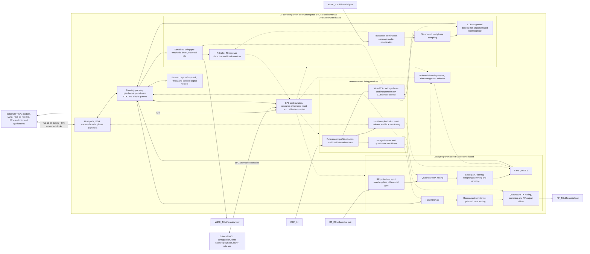

# Whole-chip architecture and implementation map

**Configuration boundary:** protocol names are external FPGA examples, not
on-chip profiles. Configuration selects physical resources and compatible
clock, pad, direction, filter/converter and host-transport settings.

**Current operating decision:** RF and wired payload operation are mutually exclusive on the same chip. Both capabilities remain required; additional physical resource sharing is encouraged. See the [exclusive-engine policy](exclusive-engine-policy.md), which supersedes simultaneous-operation requirements below. The active behavioral model enforces payload exclusivity; complete RTL/physical enforcement and resource rebudgeting remain open.


[Open the circuit-block SVG](../docs/diagrams/transceiver-block-diagram.svg) · [PNG preview](../docs/diagrams/transceiver-block-diagram.png)


The SVG expands the intended architecture into amplifier, mixer, filter, converter, clock-loop, reference, diagnostic and control blocks. External I/O groups are on the edges. It preserves approximate placement neighborhoods and adds detailed transport, control, calibration and clock-acquisition wiring sheets. Named nets connect sheets, with distinct data and feedback paths. It is a functional view, not a scaled floorplan or a claim that every circuit is implemented.

This is the intended full first-chip design, not a diagram of completed circuitry.
It consolidates the [architecture/pin plan](../../../docs/roadmap/programmable-transceiver-pin-plan.md)
and [macro contract](../integration/macro-contract.md). The existing
[chip skeleton](../integration/pt_chip.sv) groups the physical obligations into
host and analog black boxes; that grouping is not sufficient implementation detail.



Solid arrows denote principal data/reference paths; dotted arrows denote control,
clock, or diagnostic connections. Arrows are functional boundaries, not finalized
wire-level interfaces. Reset and power distribution apply throughout. RF RX/TX
resources do not imply same-frequency full-duplex radio. Shared converters may
serve wired diagnostics only with explicit ownership and settling; the wired
line-rate path always retains dedicated slicers. There is no GHz global crossbar.

The RF RX fanout between input gain and I/Q mixers is a topology decision, not
a qualified shared-drain connection. Experiments must compare shared versus
isolated branch loading at identical frequency, bias and output loads before
freezing that implementation. A shared symbol in this functional diagram does
not require one transistor output node to drive both branches directly.

The analog tile family consists of locally connected switches, sample capacitors,
transconductance/current weights, summing/integration nodes and comparators.
Reusable circuit designs can be instantiated in both islands. One physical tile
cannot service unrelated continuous RF and wired clocks merely because its cell
design is shared. The programmable topology set, counts, switch networks and
resource configuration encoding still need concrete implementation.

| Block group | Current authoritative state | Important missing work |
|---|---|---|
| Transport, FIFO, SPI, capture/playback, PRBS/calibration control | Synthesizable RTL and finite functional tests; default word-rate implementation fails physical timing; wider alternatives remain separate candidates | Integrate viable timing architecture, CDC/reset/clock and bandwidth closure |
| Host physical interface | Pad transistor experiments; top-level macro remains black box | DDR gearbox, phase alignment, real FPGA and board timing, simultaneous switching |
| RF RX | Existing LNA/mixer physical research; project-specific shared/split I/Q schematic candidates and transistor LO-buffer composition | Differential RF chain, autonomous LO/bias/passives, mismatch-tolerant I/Q, noise, linearity, package and extracted integration |
| RF TX | Seeded free-running ring, AC-coupled buffers, fixed-code combinational segmented DAC and NMOS switching bridge complete a 600 ns test; separate registered DAC update tests retain glitches | Integrate registered sample playback with the RF path; actual I/Q pairing, quadrature, reconstruction, bias/output drivers, modulation spectrum and noise |
| ADC/DAC and programmable baseband | Actual 8-bit SAR controller/comparator/sampler/PDK CDAC and input/reference drivers; registered segmented DAC candidate; finite connected tests with measured errors | Full transfer/noise/ENOB, I/Q simultaneous conversion and reference loading, clocks/bias/startup, filters/gain and topology switches |
| Wired lane | Existing slicer/CDR/driver/physical research candidates | Select and compose full lane; jitter/BER, acquisition, serializer, electrical idle and receiver detection |
| Clock and bias services | Actual VCO/divider/PFD/pump/filter with RF load still aborts before requested full-loop horizon; actual reference drivers have dynamic regulation failures | Full independent RF/wired clocks, complete bias generation, acquisition/reset, intrinsic noise and concurrent loading |
| Shared diagnostics/configuration | Some digital helpers and candidate trim ABI | Complete resource graph, atomic ownership, local buffers/isolation and analog observation paths |
| Physical chip | 50-terminal connection skeleton and area/power allocations; partial digital physical screens | Custom pad ring, analog integration, package, full power/timing, DRC/LVS/PEX and signoff |

**Reference sharing is connected but not accurate enough to qualify.** Two actual
ADC channels now complete three simultaneous frames for both opposite and aligned input histories with one
compensated reference pair and reservoir. Decision-window reference span ranges
0.928–1.060 V in the aligned-input case for a1 V target, despite stable selected
codes. Phase skew, mismatch and realistic supply coupling remain untested. Duplicating
reference pairs instead still requires explicit area and power accounting.
Apply the same scrutiny to paired TX DACs and their clocks.
The stronger reference pair consumes about23.9mA unloaded in its isolated fixture;
two copies would be about47.8mA (~158mW at3.3V) before conversion load and other
bias services. That arithmetic is a planning scenario, not measured whole-chip
power or a topology selection.

The historical macro-contract sections describe earlier implementation passes;
use scoped evidence reports and the active model guide for measured results. Neither the
macro black boxes nor this diagram prove any circuit is tapeout-ready.

Boundary targets remain one 1.25/2.5 Gb/s raw full-duplex wired lane and one
approximately 2.4 GHz, 20 MHz-channel RF chain. RF transport formats are 8–12 bits
at selectable 5/10/20/40 MS/s per I/Q component, not promises of that ENOB.
RF and wired payload operation are exclusive; each configuration must fit its
selected host slot schedule. Protocol CRC, Wi-Fi DSP/MAC and PCIe endpoint logic remain
external. Optional on-chip protocol helpers must be bypassable and are not all
implemented. A generic FPGA must still meet the selected GPIO and logic budgets.

Physical boundary: eight analog pins, twenty host data pins, two host clocks,
four SPI pins, reset, reference, and fourteen supply/ground terminals = fifty.
External matching/baluns/filtering, reference oscillator, board PA where required,
and antenna are board resources, not hidden extra die terminals. The nominal
core planning ceiling is 12.92 mm² within one approximately 3.93 × 5.12 mm slot;
custom-ring fit remains unproven. Narrow temperature/supply operation is accepted.

A significant architecture gap is that `pt_analog_physical` currently exposes
sample/word streams and coarse trim/status, not all intended detection, timing,
resource-ownership and diagnostic controls. The full diagram therefore cannot
be claimed to be fully represented by the present top-level ports. Those
interfaces must be expanded and verified as the physical blocks are integrated.

## Supporting autonomous-clock experiment (historical pass 828)

`system_model/connected/autonomous_rf_lifecycle.py` provides a connected full-chip
variant with a single RF synthesizer feeding both mixers and a separate wired TX
synthesizer. It inherits live wired RX/CDR, managed configuration, independent RF
input, converter pipelines and host transport. `autonomous_rf_screen.py` checks
acquisition, reference loss, continuous phase propagation, independent RF response
and simultaneous four-path traffic. The existing declared combined-profile report
predates this variant; integrating its full impairment/quality envelope remains
required. Oscillator parameters are assumed and physical qualification is absent.

The expanded local wiring sheets separate P/N conductors and show RX offset and common-mode feedback, TX reconstruction-section feedback, wired sampling/CDR and loopback selection, and named control, clock, bias, reference and status connections. Named ports join the overview without extra package pins. Repeated I/Q circuits remain separate instances. Reconstruction biquads are a mathematical candidate, not a frozen circuit implementation.


## Shared wired-pad and RF connectivity

Keep RF_RX and RF_TX specialized. Keep the serial TX and RX analog paths local.
Do not create a universal GHz crossbar or route RF through USB protection.

```
WIRE_TX_P/N <--- segmented serial driver <--- serializer / burst gate
WIRE_RX_P/N ---> serial termination / CTLE / slicer / CDR ---> deserializer
      |                                                   |
      +<--> local USB branch <--> existing gearbox / timed line-state engine
            HS driver + HS RX + squelch
            FS/LS driver + single-ended RX
            selectable pull-up / pull-down / HS termination

RF_RX --> LNA --> I/Q mixers --> selectable LPF/PGA --> I/Q ADC --> host
RF_TX <-- RF driver <-- I/Q mixers <-- LPF <-- I/Q DAC <-- host
                         ^
             shared reference and selectable synthesis services

all paths <--> common bounded queues, timestamp/event scheduler, SPI and GPIO host
```

**Pin aliases:** S03/S04 (WIRE_RX_P/N) become bidirectional USB_DP/USB_DM in USB
mode. S01/S02 remain high impedance in that mode. USB is directly connected;
serial AC-coupling components are mode-specific board assembly options. No
external short between TX and RX pairs is assumed. Disable serial termination,
receiver-detect stimulus and all incompatible drivers before enabling USB.
The disabled USB branch's capacitance/leakage is included in every serial RX
channel model. This is a physical design risk, not a free mux.

For DisplayPort source use WIRE_TX; for sink use WIRE_RX. Leave the other path
inactive. AUX transceiver, HPD level interface and connector power are external
and connect directly to FPGA GPIOs. USB VBUS power switch/current limit, 5 V
sensing/level translation and connector protection are also external to the
chip and controlled by the FPGA. No VBUS pin or 5 V exposure is silently added
to a 3.3 V analog pad. RF matching, filtering, antenna switch and any external
PA remain board resources. A single board exposing all connectors needs a
separately characterized external switch or assembly selection; a passive tee
is not an acceptable universal connection.


USB transport reuses the existing host frame engine with eight-word frames;
the final circuit sheet's host block is the same resource as the normal frame
engine, not an additional fast bus. Prefer reconfiguration of wired timing,
current-source, slicer and sampling resources; the bidirectional local pad
branch and FS/LS observations remain electrical obligations.

## Multi-instance HDMI/DVI connectivity

Three copies of the existing wired lane serve three TMDS data pairs. FPGA
opaque-word links connect to H2D (source) or D2H (sink) on each die. A board
clock driver/receiver handles the fourth cable pair and distributes the pixel
reference to REF_IN. Common launch/word alignment and deskew live in the FPGA.
Within each die add switchable DC current-sink/termination behavior and a
forwarded-word x10 clock configuration; reuse the existing serializer/sampler.
The multi-chip topology is shown on the final diagram sheet. No extra per-die
terminals or simultaneous RF/wired payload are assumed.

[HDMI/DVI board and pin plan](../../../docs/roadmap/programmable-transceiver-pin-plan.md#hdmidvi-through-multiple-instances).
