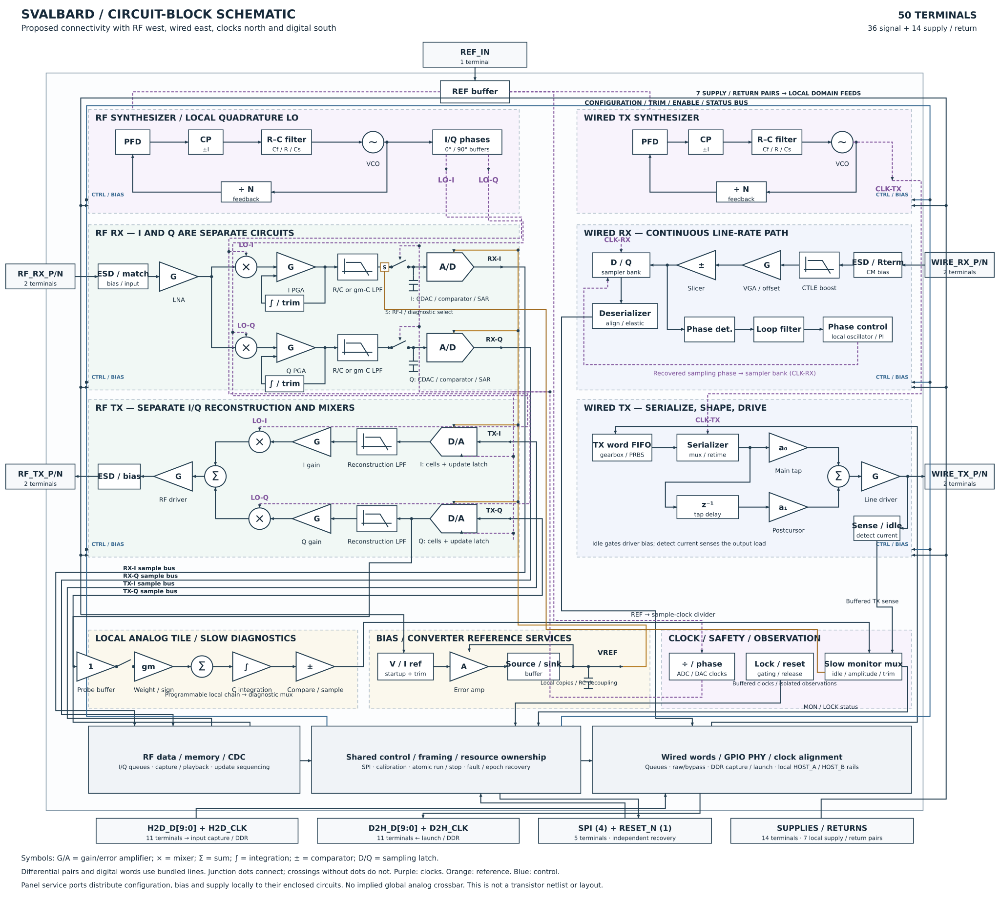

# Normative whole-chip architecture

[Full-chip SVG](../docs/diagrams/transceiver-block-diagram.svg) · [PNG preview](../docs/diagrams/transceiver-block-diagram.png)

This document owns the selected functional architecture. “Normative” specifies
what the design must implement, not demonstrated silicon performance or a frozen
circuit topology. The drawing places RF west, wired east, timing north and host
logic south, with terminals at the perimeter. Neighborhoods are intentional;
block areas and routes are not a physical fit result.

## Selected boundaries

- One GF180MCU die in one wafer.space slot, 50 total terminals. The 12.92 mm²
  core allocation includes 2.92 mm² reserve; neither is an implemented area.
- Both RF and wired capabilities are fabricated, but their payload operation is
  mutually exclusive. Retain specialized RF frontends and wired line-rate
  samplers. Share transport, control, slow bias/reference services and reusable
  circuit designs where loading permits. No universal GHz analog crossbar.
- Configuration selects numeric clocks, pad modes, gain, filtering, conversion
  and transport settings. Protocol recipes reside on the FPGA, not in chip
  protocol profiles. Narrow temperature and supply operation is acceptable.
- FPGA owns modem/PCS/controller logic, CRC/FEC, bulk storage, sample-rate
  conversion and TX interpolation. Chip storage is bounded CDC, elasticity,
  update staging and deadline-critical service; its complete cost remains open.

## Timing: two credible operating paths

Provide autonomous synthesis **and** an alternate externally supplied timing
path as first-class design requirements. Neither is yet physically qualified.
`REF_IN` is the single allocated timing input: select reference, wired timing or
RF LO operation while stopped. A GHz LO requires its own qualified input
conditioning branch; it must not pass through an assumed ordinary GPIO buffer.
There is no simultaneous separate reference and LO input on this terminal.

The RF source feeds local I/Q phase generation, mixer buffers and selectable
sample dividers. The current mathematical candidate uses LO ÷64/128/256/512 for
conversion and LO ÷16 for the D2H forwarded DDR clock. These sample rates track
LO tuning; they are not exact fixed 5/10/20/40 MS/s promises. FPGA resampling
must include causal delay, arithmetic, memory and sustained service cost.

Wired TX retains selectable synthesis/external timing and flexible ×10
serialization. Wired RX always retains independent clock/data recovery and
phase control. External timing does not remove additive jitter, quadrature
error, clock distribution noise, or host rate matching. Clock switching requires
stop, isolation, settling/lock qualification, retraining and a new stream epoch.
See [clock ownership](clock-rate-ownership.md) for detailed obligations.

## RF conversion chain

RX: board preselection/matching → protected differential LNA → separate I/Q
mixers → selectable PGA/LPF with offset/common-mode control → paired ADCs → host.
The schematic must resolve PGA/filter ordering and stage headroom; an ADC that
never clips does not prove the upstream chain stayed linear.

TX: FPGA interpolation/resampling → host → registered paired DACs → selectable
reconstruction filtering/gain → I/Q upmixers/summation → RF driver → board
matching/filtering and optional external PA. Use proper interpolation in the
system model; sample repetition is a comparison fixture, not the selected
wideband TX implementation. Filter order and transistor realization remain open;
older two-biquad drawings do not freeze them.

Keep narrow and wide filter settings. Wider settings improve some clean-channel
fixtures but admit more blockers; narrow settings must remain available.
Longer synthetic training has helped diagnostic recovery, but does not establish
recovery from a real protocol preamble. FPGA modem work must close that gap.
Converter word width is not achieved ENOB. Driver output power, RF noise,
linearity and modulation quality must close together at actual supply/headroom.

## Wired paths and specialized pad branches

Serial RX: protected pads / selectable termination and common mode → equalizer
→ slicers / phase sampler / independent CDR → deserializer and alignment.
Serial TX: gearbox / serializer → programmable main/postcursor driver, idle and
load detection. Preserve a DC-coupled TMDS electrical branch; a generic serial
swing model alone does not qualify HDMI/DVI.

`WIRE_RX_P/N` also carries bidirectional USB D+/D− through local HS and FS/LS
receivers/drivers, squelch, pulls and switchable termination. `WIRE_TX_P/N` is
high impedance in USB operation. USB controller and VBUS circuitry remain
external. No RF routing through the USB protection network.

HDMI/DVI uses multiple identical lane dies plus external forwarded-clock
interface/fanout. Cross-die phase alignment and continuous FIFO operation remain
requirements. DisplayPort is one RBR lane per die. HD-SDI requires external
coax circuitry. The [README](../README.md) owns the application target list;
these are conditional capabilities, not compliance claims.

## Supplies, references and board support

Keep seven supply/return pairs: CORE ×1, HOST ×2, WIRE ×2, RF ×1, PLL ×1.
Provide startup/trimmed bias, buffered converter references, local reservoirs
and isolation. Share reference sources only if dynamic loading permits; retain
local buffers or replicas and account for their current. On-chip regulators
and particular compensation networks are candidates, not frozen requirements.

External regulation, clocks and many SMD passives are normal supported board
resources. External loop filters or observations needing additional terminals
are **not** implied by this allowance. The existing pin budget must accommodate
any eventual off-chip analog connection explicitly.

Do not freeze a particular decoupling network from the passing 1 MHz screens.
Host edge harmonics, reference/LO feed impedance, regulator stability, capacitor
ESL/derating and package/shared-return coupling remain unresolved. RF/wired
exclusivity does not stop host switching or eliminate inactive leakage.
See [power partition](power-partition.md) for budgets and conditional studies.

## Observation and implementation order

Use SPI status/configuration, existing host sample/word capture and independent
known external stimuli. FPGA/lab equipment stores captures. Shared-LO loopback
alone can hide clock defects; no unbudgeted analog test pins or universal
internal overload detector are assumed.

Finish the connected mathematical model before new schematic/layout work.
Then implement the complete transistor/passive schematic using the planned
[six-family primitive library](analog-design-workflow.md), verify it, and carry
the same requirements into extracted layout. The highest-risk gates remain
clock quality, complete RF conversion and physical supply/pad/package coupling.
Current evidence and uncertainty ranges live in [risk priorities](risk-priorities.md),
not in this architecture drawing.

## Diagram ownership

`docs/diagrams/generate_block_diagram.py` regenerates the overview and supporting
sheets; `generate_normative_diagram.py` owns the normative SVG. The PNG is a
render of that SVG. Differential conductors and words are bundled, and local
bias/clock/control fanout is named rather than drawn as individual wires.

[Detailed circuit candidates](../docs/diagrams/transceiver-circuit-candidates.svg),
[RF loaded-chain sheet](../docs/diagrams/transceiver-rf-loaded-detail.svg) and
[video assembly sheet](../docs/diagrams/transceiver-video-detail.svg) preserve
exploratory connectivity. Their specific filters, monitors, memories, regulators
and numerical assumptions are not additional normative requirements. The
selected architecture above takes precedence over those historical candidates.
