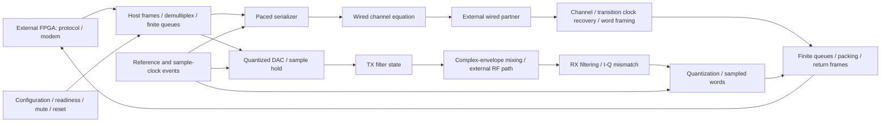

# Executable mathematical transceiver architecture

Run from the repository root:

```sh
python3 projects/programmable_transceiver_platform/system_model/connected/run_architecture.py
```

The runner executes fresh scenarios and records source hashes, individual result
hashes and logs in `evidence/connected-architecture-suite.json`. It refuses
optimized Python execution because acceptance checks use assertions. Passing
means the listed scenarios passed; `complete_architecture` remains false until
the open integration requirements below are closed. No SPICE runs are needed.

## Connected signal paths



`chip_model.py` connects both wired directions and both RF host directions.
The RF partner loopback returns actual ADC words to external-host pilot fitting
and symbol decisions. Host framing, payload packing, consumption deadlines,
finite storage and previous-frame staging are explicit. Timing recovery sees
received transitions; it does not receive the transmitter's clock as an input.
The external wired TX checker still uses prescribed sampling.

RF equations operate on complex envelopes, avoiding carrier-frequency SPICE
steps. One-pole states and sample holds propagate analytically. A separate
multicarrier scenario uses occupied subcarriers through the framed DAC-to-ADC
path, then freezes externally fitted equalization before scoring held-out data.
This is a waveform experiment, not a complete Wi-Fi modem or compliance test.

The two contract modes combine 1.25 Gb/s wired + 40 MS/s 12-bit I/Q, or
2.5 Gb/s wired + 20 MS/s 8-bit I/Q. These are architectural targets. FPGA
protocol logic, PCIe endpoint functionality and Wi-Fi baseband remain external.

## Reset contract under test

`rf_reset_transport.py` exercises every possible reset position in a host frame
in both modes, during prefill and active playback (256 cases). Active cases
verify nonzero analog state at reset and its analytic decay through the drain
barrier. Old RF payload remains in flight through the real frame codec.
RF acceptance is disabled, queued DAC values are discarded, and independent
wired payload continues unchanged. The host stops old RF production and names
the final old frame through an abstract coherent management acknowledgement.
Only after that frame drains may the RF stream resume at a sample boundary.

Premature rearm is a negative control: it accepts stale old samples in both
modes. Thus clearing the DAC queue alone is insufficient. The drain handshake
still needs a concrete management register/CDC implementation. This scenario
uses word-aligned finite bursts and does not establish arbitrary burst flush.
`rf_tx_state.py` separately verifies that analog filter charge persists and
decays after reset, rather than vanishing when a software flag changes.

## Late burst faults

`burst_fault_screen.py` carries malformed final padding through actual host
frames into a latched RF fault. Queued RF samples are discarded, the held DAC
value becomes zero, and filter charge decays rather than disappearing. Wired
words continue in order. A first-fault snapshot retains the already decoded and
consumed counts; setting readiness does not clear the fault. The test deliberately
consumes a sample before the late fault, making the streaming exposure explicit.

This is a behavioral adapter with instantaneous fault-to-mute propagation.
Serialized host notification, physical CDC latency, drain acknowledgement and
new-epoch recovery remain open. It is included in the architecture regression;
passing it does not replace a complete shared lifecycle implementation.

## Closure requirements

- Extend the persistent lifecycle controller to independently paced, bidirectional
  analog paths; its framed transition tests currently consume RF samples on arrival.
- Integrate the finite-burst sample-count/padding contract with management
  descriptors, back-to-back epochs and reset. Codec and timed-return tests now
  cover partial final words, empty streams and near-capacity phase sweeps; these
  do not yet establish a complete burst lifecycle.
- Connect PLL acquisition, lock loss, clock phase noise and sample jitter.
- Add causal converter/reference dynamics, blockers, compression and aliasing.
- Connect shared supply and uncertain package loading as explicit assumptions
  and sensitivity sweeps, not inferred physical guarantees.
- Exercise clock stalls and variable CDC visibility, with explicit fault and
  recovery behavior and bounded queues.

These are remaining mathematical integration tasks. Transistor performance,
layout, area, power, package coupling and protocol compliance require separate
qualification even after all mathematical scenarios work.

## Persistent whole-chip lifecycle

`whole_chip_lifecycle.py` joins the existing frame codec, RF burst decoder,
stateful DAC/filter consumer, wired channel and session controls in one object.
Four scenarios cover both mode-change directions, reference loss during traffic,
rejected early drain acknowledgement, stale-event rejection, reacquisition,
back-to-back finite/empty bursts and host-watchdog mute. Filter state survives
reset. Mode changes deliberately quiesce both engines.

This is an executable candidate management contract: fixed lock acquisition time,
instantaneous loss detection and coherent drain messages are assumptions. Epoch
tags are simulation bookkeeping, not extra fields in the chip payload format.
The lifecycle screen consumes samples on arrival; the separate full signal-path
scenarios verify independent sample pacing. Their combination is not yet one
fully integrated timed simulation.

Additional lifecycle controls verify that a reference arriving after configuration
starts a fresh acquisition interval, and that an incomplete burst faults the
shared controller. Rejected stale events do not refresh the host watchdog.

## Independent DAC clock in the shared controller

`timed_lifecycle.py` extends the persistent controller with explicitly scheduled
DAC edges at40/20MS/s and ±100ppm. Eight cases cover both modes and two host
phases, prefilled framed bursts, loss of reference with samples still queued,
retained analog state, mode change/reacquisition, and latched underflow. An edge
at the same time as incoming data occurs first; delivery never controls the
sample clock. This is a small-burst integration test. Wired consumption and RF
receive/return still need independent events in this same controller.

The timed controller now also queues wired TX words and consumes them at
independent ten-bit word deadlines (125/250Mword/s with configurable ppm error).
Eight simultaneous-path cases exercise both independent clock-error signs,
coincident wired/DAC events, partial consumption of both queues before reference
loss, discarded-tail accounting, mode recovery and wired underflow. The channel
advances its ten serialized bit states per word event; continuous partial-word
reset behavior and RX/return integration are still open. The queues have explicit
128-entry capacity. These are small-burst checks, not sustained-throughput proof.

## RF sampling and timed host return in the same controller

`rf_return_lifecycle.py` extends TimedChip with ADC sample deadlines, a bounded
128-word return queue,64-word frame staging and independent host output edges.
It samples retained TX filter state through explicit ideal coherent RF gain and
ADC quantization. The external host decodes real return frames and finite-burst
padding. Eight cases cover two modes, opposite clock offsets and reference loss
with return data queued. Successful round trips preserve every captured sample;
the first sample also matches the analytic TX step response after quantization.

RX filtering/mixer noise and wired receive are not yet integrated here. Fault
handling aborts the partially emitted frame and assumes coherent host reset;
serialized notification and reacquisition must replace that assumption. Small
bursts establish connected behavior, not full-throughput closure.

## Four paths in one persistent controller

`wired_return_lifecycle.py` adds recovered wired input to ReturnChip. A fixed
external waveform passes through the existing channel, transition-based timing
recovery and test-marker framer. Recovered words enter a bounded128-word queue
at their actual completion times and share return frames with ADC data. Sixteen
cases cover both modes,±0.3UI acquisition phase,±100ppm and interrupted receive.
Normal cases verify all80 wired words and three ADC samples at the host while
both TX paths run. Fault cases verify prefix delivery and no later stale output.

This connects all four directions for finite test traffic. The wired waveform
is analyzed in advance; online receiver feedback under shared disturbances is
not modeled. Recovery after partial host frames is still an assumed coherent
abort. These limits, plus full-rate traffic and analog/clock assumptions, prevent
a full-chip mathematical completion claim.

## Sampling timing sensitivity

`sample_clock.py` schedules edges from an absolute nominal phase plus bounded
four-edge periodic modulation. ADC and DAC now use it in the persistent model;
zero modulation retains the previous clock assumption. `jitter_lifecycle.py`
checks opposite ADC/DAC timing errors of±100ps and±2ns in both modes, including
reference-loss interruption. Ten cases pass; larger modulation demonstrably
changes ADC codes while return transport preserves them. Clock controls verify
monotonic edges, bounded error and no accumulated phase drift over1000 periods.
This is an explicit sensitivity stimulus, not random jitter, calibrated phase
noise, PLL acquisition, or an EVM/BER qualification.

## Continuous receive-filter state

ReturnChip now uses `RfCascadeState`: two equal10MHz one-pole filters between
DAC holds and ADC sampling. RX state is propagated from the exact continuous
TX trajectory, including every DAC transition. Extra host events merely subdivide
that trajectory. Analytic controls check step response,100-way subdivision and
retained RX/TX state after reset. Ideal coherent gain commutes with these linear
filters; frequency offset, mixer noise/compression and unequal programmable poles
are still absent. This supersedes the earlier unity-RX-bandwidth assumption.

## Explicit partial-frame abort barrier

ReturnChip retains host decoder position after quiesce. Management must call
`acknowledge_host_abort` for the stopped epoch to discard partial framing/burst
state before `acknowledge_drain` can permit configuration. Wrong epochs and early
drain are rejected. Already delivered samples are never rolled back.
`return_epoch_recovery.py` covers every64-word frame position in both modes,
delayed acknowledgement, mode change and subsequent wired/RF host delivery on
the same object (128 cases). This supersedes automatic coherent host reset.
Acknowledgement transport is still abstract, and restart assumes aligned word
clocks at a new frame boundary rather than proving pin-level acquisition.

## Finite sustained traffic

`sustained_lifecycle.py` generates128 frames' worth of source data over time,
then transports it through129 host frames (the first frame has no generated
payload yet). Both modes and±100ppm complete all four paths without loss or
underflow:4096/6553 wired words and1310/524 RF samples per direction. Source data
becomes visible only after its production interval; playback starts after three
host frames. TX capacities now derive from the contract's2048-bit egress budget:
204 wired words and85/128 complex samples. These are planning capacities, not
implemented RTL depths. Runs last26–33us and do not establish infinite-duration
drift bounds. Reported queue peaks are observations at host events.

## Dynamic lock qualification

`clock_lock_lifecycle.py` adds a DuplexChip variant with analytically propagated
critically damped phase/frequency error and40MHz reference observations. Eight
consecutive observations inside explicit phase/frequency thresholds qualify
readiness; an injected phase excursion causes shared quiesce. Eight cases cover
both initial-error signs and both modes with received data after acquisition.
This replaces fixed-delay readiness in this variant only. Payload edge timing
still uses separate clocks; coupling loop state into those edges is required.
The linear loop is a near-lock mathematical assumption, not nonlinear capture
or a calibrated transistor PLL.

## Loop phase drives sample edges

`loop_driven_edges.py` supplies PhasedChip, deriving ADC/DAC edge times from the
same linear phase trajectory used for lock qualification. It solves
`t + phase(t)/40MHz = nominal_edge` inside a local bracket. Controls cover zero
error, error-sign reversal, monotonic edges and invariance to splitting the loop
state propagation. Four connected cases preserve all payloads and demonstrate
nonzero signed DAC timing shifts. This assumes an undisturbed trajectory after
scheduling; phase/frequency interventions must invalidate pending deadlines
before this variant supports disturbances during active playback. Wired and host
edges remain independently prescribed.

## Active loop interventions

PhasedChip now exposes `disturb_clock`, propagating the old loop to the event,
applying phase/frequency changes and atomically replacing ADC/DAC future-edge
predictions while retaining their sample indices. If either edge would lie at
or before the intervention, the shared controller faults and mutes instead of
replaying or silently skipping it. Four signed retiming cases and two past-edge
fault cases pass in `clock_disturbance_lifecycle.py`, including simultaneous
wired traffic and exact sample counts. This supersedes the undisturbed-only
restriction when interventions use this API. Direct mutation of clock state
still bypasses rescheduling and is not a supported active-playback operation.

## Sustained traffic on the loop-driven controller

`clocked_sustained_lifecycle.py` runs the same128-frame workload using PhasedChip,
waiting for actual dynamic lock before source production. Eight mode/ppm/sign
combinations apply opposite signed phase/frequency disturbances at frames40/80.
All16 interventions change pending ADC/DAC times, and complete wired/RF payloads
are preserved with no underflow. This joins dynamic readiness, sample-edge
prediction, active retiming, continuous filters, framed transport and sustained
four-direction traffic in one controller. Wired/host clock physics and RF/reference/
supply impairments remain assumptions; finite runs do not prove universal bounds.

## Causal ADC reference assumption

ReferenceChip adds finite reference capacitance, exponential recovery through
resistance and signal-dependent charge removal after each conversion. The next
ADC conversion uses the resulting reference span. It uses actual sample times
and input values, with no recorded transistor voltage inputs. Six sustained
loop-driven cases cover zero loading and two RC extremes. Analytic charge/recovery
and subdivision controls pass; zero loading exactly reproduces ideal ADC words.
The high-resistance case changes returned ADC words without transport loss.
This is an assumed aggregate conversion law, not intra-SAR settling, fitted
buffer dynamics or a demonstrated physical uncertainty envelope.

## Sampled receiver frontend impairments

ImpairedChip extends ReferenceChip with symmetric I/Q gain imbalance, Q-axis
phase error, radial smooth compression and independent Gaussian noise per ADC
component. Noise state advances only on conversions. Six sustained cases test
zero impairment and both mismatch signs in both modes; zero impairment matches
the complete ADC-stream digest, while impaired streams differ and still arrive
intact. Controls verify analytic basis mapping, odd compression, bounded output,
repeatable noise and expected noise power. These blocks are located after RX
filtering at the ADC frontend. They do not model RF blocker compression, a
continuous noise spectrum, or modem EVM; parameters are illustrative assumptions.

## Host switching to analog supply sensitivity

CoupledChip adds charge impulses from actual H2D data transitions and clock edges
to a lumped RC rail. Between events the voltage recovers analytically. ADC-side
receiver gain responds to rail deviation with a configurable signed sensitivity,
then passes through the existing frontend, reference and quantizer. Six sustained
cases cover both modes and zero/positive/negative sensitivity. Zero sensitivity
reproduces baseline ADC words; both signs alter words without transport loss.
The assumed RC gives26–30mV peak droop and about±5% sampled gain variation.
These are sensitivity results, not package predictions. Return-bus/internal
activity, inductance and coupling to PLL/DAC/digital thresholds remain absent.

## Return switching closes the supply feedback path

The host-return serializer now reports each emitted physical word to a supply
hook, including framing and idle payload slots. CoupledChip can charge the same
RC rail for D2H clock/data transitions as H2D transitions. ADC samples occur
before coincident return switching, so output activity can affect later samples
without an algebraic same-sample loop. Six sustained both-direction cases pass
with zero/positive/negative gain sensitivities; direct transition-count and total
charge accounting controls pass. Zero sensitivity preserves the ADC stream.
The two buses still share a hypothetical lumped rail, with no separate pad-domain
or substrate impedance, PLL/DAC supply response or internal logic current.

## DAC supply sensitivity

The DAC consumer now applies a configurable gain at each actual DAC edge before
holding the output. CoupledChip samples the same RC rail used by the receiver;
both host buses can disturb it. Six sustained cases cover zero and both signs
of DAC sensitivity in both modes. Zero sensitivity matches the baseline ADC
stream, while nonzero sensitivity changes samples without transport loss.
Controls check hold behavior and queue accounting. Continuous supply feedthrough
between DAC updates and PLL supply response are not yet represented.

## Completion criteria versus physical refinement

The authoritative missing-function inventory is now
[mathematical-closure.json](../../spec/mathematical-closure.json), derived from the
intended block diagram and rate/pin contracts. The suite includes this inventory
and its basis files in the source snapshot. A green suite alone is not closure.
Unknown transistor parameters may remain explicit model assumptions; missing
routing/control functions, unsustainable rates or incorrect causal ordering may
not. Device calibration, extraction and physical compliance belong to subsequent
stages. This distinction avoids indefinitely expanding mathematical closure into
transistor qualification while overlooking whole-chip functional omissions.

## Common-reference payload rates

The sustained workload now has an explicit matched-reference mode. External
rational accumulators generate payload enables from chip-forwarded D2H edges;
local DAC/serializer average rates use those same ratios. H2D service edges can
have independent signed ppm error. Exact integer arithmetic determines which
forwarded edges are visible at each service-frame boundary, without future data.
Eight signed reference/service combinations pass. Rational production rates
match the independent contract source-rate definitions, and worst signed service
rate has positive reserved bandwidth margin. This removes secular producer/
consumer rate mismatch under the shared-reference assumption. It does not yet
prove queue bounds for arbitrary phase, CDC delay, service gaps or lock transients.

## Delayed source visibility

Matched-reference workloads now admit fixed source visibility lag and fractional
phase in host-word periods. Exact rational arithmetic prevents negative-time or
future-source availability; production continues until all generated payload is
visible and transported. Sixteen2/32-edge delay,±0.49-edge phase and opposite
ppm cases pass without enlarging queues/prefill. Two256-edge negative controls
fault on payload underflow. This tests fixed availability delay, not variable CDC
latency, pin metastability or arbitrary host stalls. A passing endpoint set is
not a proof of every phase or indefinite queue safety.

## Host service pauses with continuing production

Matched-rate workloads can pause H2D service at declared frame boundaries.
Absolute elapsed time, not number of served frames, controls source production;
DAC, wired TX, ADC and return clocks continue during pauses. Eight cases test
repeated16-word and single64-word pauses across both modes/opposite clock errors,
with unchanged prefill and capacity. Two256-word pauses explicitly underflow.
Per-pause counters verify that consumers were not stalled to manufacture success.
Mid-frame pause/reacquisition and universal service/CDC queue bounds remain open.

## One-shot sample capture bank

CaptureChip connects actual quantized ADC words to a32x24 one-shot bank, matching
the size/read-until-done/stop-on-full behavior in `rtl/pt_memory.sv`. Reads before
32 valid samples return zero; further samples cannot overwrite a completed bank.
Configuration requires disarmed state, and shared quiesce disables incomplete
capture. Two sustained cases enable receiver imperfections, both signed supply
paths and clock interventions together and verify captured words against the
first32 ADC samples. Mode1 occupies the low16 bits of each24-bit entry. SPI/CDC
and ABI equivalence are not proven; playback and MCU capture-only operation
remain to connect.

## Playback bank owns the DAC source

PlaybackChip adds a separate32x24 bank with disarmed writes and complete-bank
validity. Selecting playback excludes host IQ descriptors. Actual DAC deadlines
request one word from memory; pointer advance never depends on host arrivals.
Four both-mode complete/interrupted cases verify sample order, simultaneous ADC
capture/return and wired RX, partial abort and retained loaded contents. Missing
loads, live writes/source changes and accidental exhausted-bank replay are
rejected. Completion holds the last DAC amplitude. Engine quiesce disables the
source; global memory reset and SPI/loaded-flag CDC remain separate obligations.

## Management-only finite operation

ManagementChip selects local RF capture/playback without H2D input or D2H output
clocks. The streaming watchdog is explicitly disabled for this mode, while
reference/lock faults remain active. ADC samples route to the32-entry bank;
32 coherent reads spaced10us apart recover the completed snapshot. Four cases
cover both formats and interrupted capture; no host output edges or switching
charge are generated. Reads are timed management transactions, not SPI/CDC proof.
The signal source remains the external RF loopback fixture. Local source selection,
repeated capture rearm and global-memory-reset coverage remain incomplete.

## Repeated memory epochs and validity reset

Capture verification now records each rearm's ADC-history offset. The same chip
can complete three successive capture/playback operations with mode changes,
without comparing later captures to the first-ever samples. Six epoch cases pass
in `memory_rearm_lifecycle.py`. Engine stop preserves loaded playback contents;
explicit disarmed memory reset invalidates all playback initialization and capture
validity. A partial reload cannot play. Neither operation clears analog filter
state. Invalid entries represent validity flags, not physical SRAM bit clearing.
Full asynchronous chip reset and management CDC timing remain separate work.

## Independent programmable filter settings

RfCascadeState now propagates unequal TX/RX poles analytically, with a stable
near-equal-pole expression and exact no-op for zero elapsed time. FilterChip
selects2/5/10/20MHz per stage while disarmed. Changes preserve current filter
state; unsupported selections/live changes are rejected. Six integrated cases
produce distinct captured waveforms, with analytic unequal/equal-limit and event
subdivision controls. These tuning values are hypothetical functional settings,
not demonstrated GF180 ranges; switch injection and higher-order responses remain
refinement work. This supersedes the fixed equal10MHz-pole restriction.

## Exclusive receive routes and local gain

RoutedChip atomically configures RX source selection, baseband gain and filter
settings while disarmed. Selections are the existing external loopback fixture,
an independent external tone envelope, and mute. The external input drives the
RX filter continuously, independent of DAC values; tone propagation has an exact
analytic solution. Twelve mode/route/gain cases pass, including changed gain
responses, muted output and rejected live/invalid configuration. Invalid groups
leave prior settings unchanged. These are model/testbench routing choices, not
new physical inter-island wiring or a complete RF mixer/LO implementation.

## Diagnostics and limited register access

DiagnosticChip exposes a copied coherent state snapshot covering lifecycle,
readiness/faults,loop qualification,queues,memory and RX settings. A limited
management adapter follows existing pt_spi.sv identity/mode/rejected-write,
trim-storage,index and split capture-data fields. Both-mode tests cover partial
capture,completion,all32 split-word readbacks and reference fault. Unsupported
packed status address3 raises an error instead of inventing a mapping. Named
snapshots are simulation interfaces,not newly allocated registers. Trim storage
is explicitly unapplied; calibration mappings and SPI/CDC visibility remain open.

### Pass 798 — independent RF oscillator conversion before filtering

The previous status-only turn made no implementation progress. Added independent
TX/RX LO frequency offsets and phases to the connected RF envelope cascade, with
exact continuous mixing before the receive pole. External sources depend on the
RX LO alone; common TX/RX LO shifts cancel only in the loopback fixture. Settings
are disarmed-only and validated atomically. Zero-offset defaults retain the old
cascade calculation. No GHz carrier time stepping is needed.

Ten integrated both-mode playback/capture cases pass, with exact host return and
32 consumed DAC samples each. Independent midpoint integration and subdivision
check the complex convolution, including nearly equal poles and signed offsets.
A 2MHz RX pole passes 89.4% amplitude at 1MHz mismatch but only 7.97% at 25MHz:
signal quality can fail while digital transport remains operational. The first
20,000-step quadrature missed the 2e-9 tolerance by about 5%; doubling numerical
resolution reduced the discrepancy without loosening tolerance. Routing and
filter regressions pass. Constant ideal oscillators are not autonomous physical
LOs; phase noise, acquisition, supply response, blockers/images and modem carrier
recovery remain outside this increment. Mathematical closure remains incomplete.

Fresh aggregate verification: all36 scenarios passed with unchanged source hashes,
including the new LO checks and all prior registered scenarios. This verifies the
declared scenarios; the full-chip closure inventory still contains open requirements.

### Pass 799 — RF blockers and weak nonlinearity before conversion/filtering

Previous pass made verified progress. Added a bounded complex RF-envelope cubic
x + alpha*x*|x|^2 before the ideal mixer and RX filter, with up to four independent
blocker tones. Exact exponential expansion integrates the cubic products through
the continuous receive pole without GHz carrier stepping or a numerical timestep.
The loopback expansion includes evolving TX filter state and independent LO offsets.
Mute disconnects the input, retaining filter decay. Configuration is atomic and
disarmed-only. A conservative input-envelope bound and |alpha|*limit^2 <=0.25
prevent extrapolation into an unmodeled overload regime; range violations stop the
simulation explicitly rather than pretending to model hardware fault detection.

Independent quadrature, event subdivision, signed third-order intermodulation,
range rejection and moving-TX/LO controls pass. Two blockers at10/20MHz produce
a DC product alpha*A^2*conj(B), demonstrating why filtering after a nonlinear
stage cannot remove all blocker damage. Six finite playback/capture cases and
four sustained simultaneous wired/RF cases pass in both modes, with positive and
negative coefficients, matched-reference source rates, host clock mismatch and
sample-clock disturbances. All sustained transport/accounting assertions hold.
The ten existing LO cases and twelve routing cases also pass.

This is weak RF-envelope nonlinearity, not a calibrated LNA/mixer or overload model.
Absolute RF gain/bandwidth, images, leakage, noise and comprehensive alias/blocker
limits remain open. The scenario is registered in the aggregate runner; this pass
ran targeted checks, so the previous36-scenario aggregate report is historical.
Full mathematical closure is still incomplete; schematic and layout work remain
behind that milestone.

### Pass 800 — causal RF phase trajectories and combined four-path impairments

Previous pass made verified progress. Added PhaseChip with scheduled TX/RX LO
phase and frequency changes. Advance the complete chip to each intervention under
the old oscillator settings, then change future mixing while retaining analog
filter charge. Frequency changes preserve instantaneous phase unless an explicit
phase step is requested. Coincident ADC/DAC events execute before intervention.
Invalid or reordered schedules are rejected atomically. Events represent external
physical disturbances, not software register writes or an RF lock detector.

Analytic phase/frequency response and event-subdivision controls pass. Four
sustained cases plus two baselines show bit-identical cancellation of common LO
phase in ideal zero-delay loopback, and changed ADC data for independent phase.
The fixture uses151 seeded bounded phase samples on a100ns grid from5us to20us,
with absolute phase bounded to +/-0.15rad. It is not a calibrated phase-noise PSD.

Four additional cases combine both signs of RF cubic coefficient, RX/DAC supply
sensitivity and frontend gain/phase error with blockers, reference charge loading,
frontend saturation/noise, independent RF phase trajectories, sample-loop
interventions, host-rate mismatch and a16-word-period service pause. Both
throughput modes pass sustained wired/RF transport, queue accounting and exact
ADC-code return. This closes the isolated-knob-only testing gap for those modeled
resources; it does not establish modem signal quality or hardware feasibility.
Ten LO regressions also pass. New scenario registered; aggregate report from
pass798 remains historical until rerun. Autonomous RF lock, supply-to-LO coupling,
noise spectrum, missing wired/control contracts and converter envelopes remain.

### Pass 801 — signal-quality classification beyond lossless transport

Previous pass made verified progress. Added held-out waveform comparison against
an ideal envelope/quantizer run with identical source, filter and sampling times.
Fit one complex gain on the first quarter, freeze it, and score remaining samples;
report raw error, corrected error and gain separately. No time alignment, adaptive
carrier correction or post-hoc equalizer hides LO errors. A0.5–2 gain range rejects
a nearly dead channel even if scalar normalization would conceal its loss.
A provisional10% incremental waveform RMS budget is explicit, not protocol EVM.

Sixteen impaired/ablation runs and four matched ideal runs complete with sustained
wired/RF accounting and exact ADC-code transport. Combined cases fail the screen
at25.5–26.9%; severe phase cases fail at89.6–100.8%. Removing blockers reduces
error to9.8–11.7%; removing RF phase variation alone leaves23.6–24.5%. These are
signal-quality failures in assumed conditions, not failed test infrastructure.
Synthetic controls verify identity, static gain/phase correction, rejection of
zero/low gain and a phase reversal confined to held-out samples. Updated risk
priorities to address selectivity and admissible blocker/phase budgets next.

The reference includes intended filtering and quantization, so this measures
incremental error, not total transmitter-to-demodulator EVM. A single-tone fixture
cannot establish Wi-Fi performance. No physical feasibility claim follows.
Registered scenario; targeted verification only, full aggregate remains historical.

### Pass 802 — preserve RF channel bandwidth while specifying selectivity

Previous pass made verified progress. Rechecked the intended roughly20MHz RF
channel against the10/20MHz blocker fixture:10MHz is at its nominal edge, not a
clean stopband point. Preserve that boundary stress test and add20/30MHz blockers
with identical amplitudes and all other combined assumptions unchanged. Both
modes still fail the provisional10% waveform budget:18.3/19.7% for20/30MHz versus
25.7/26.5% for10/20MHz (positive-sign cases). Six sustained runs including matched
ideal references pass transport and sampling-time checks. Nominal alias locations
are reported separately; they are not a complete phase-noise sideband spectrum.

A proposed8MHz/1dB passband and20MHz/30dB stopband yields minimum Butterworth
order5, cutoff9.1574MHz, and33.93dB loss at20MHz. The existing10MHz single pole
loses2.15dB at8MHz and only6.99dB at20MHz. The next-lower order fails the proposed
stopband requirement at a cutoff preserving the passband. These are explicit
candidate screening targets, not inferred Wi-Fi limits. No multipole filter is
yet implemented; the transfer-function calculation alone is not system or silicon
qualification. Next: integrate the candidate and a modulated wanted signal without
silently reducing channel bandwidth or changing the10% screen. Registered targeted
scenario; full aggregate remains historical. Mathematical closure remains open.

### Pass 803 — continuous fifth-order receive filter in connected traffic

Previous pass made verified progress. Implemented optional Butterworth RX filtering
as exact continuous modal states, driven by the same RF nonlinear/mixer exponential
terms as the original receive pole. Refactored forcing-term generation so blockers,
TX filter transients and LO disturbances all enter before the selected RX filter.
Topology selection is initial/unenergized-only; incompatible single-pole tuning
is rejected rather than silently changing an unused parameter. Input disconnect
preserves modal charge and homogeneous decay. Default single-pole behavior remains.

Independent normalized SciPy step response agrees within1.04e-15; analytic magnitude,
event subdivision and retained-state decay checks pass. Four sustained runs use
matched multipole ideal references and combined positive-sign20/30MHz blockers.
Corrected waveform error is9.963% in mode0 and11.507% in mode1, versus18.30% and
19.66% with the one-pole receiver. Mode0 barely passes the provisional10% screen;
mode1 fails. These results support selectivity improvement, not overall RF closure.
Ten existing LO cases and four sustained plus six finite blocker regressions pass.

The existing waveform is two-frequency I/Q (different I and Q frequencies); prior
shorthand calling it single-tone was imprecise. It remains far short of a full-band
modulated wanted signal. Modal states are a mathematical realization, not a claim
of physical complex-pole circuitry. Component variation, internal noise/overload,
finite gain-bandwidth and topology-switch state mapping remain future requirements.
Registered new targeted scenario; aggregate remains historical. Mathematical
closure is incomplete and no schematic/layout milestone is claimed.

### Pass 804 — full-band custom multicarrier stimulus in sustained four-path model

Previous pass made verified progress. Added validated source-waveform injection to
the sustained driver and a seeded50-carrier QPSK fixture with312.5kHz spacing,
edge carriers at+/-7.8125MHz,3.2us useful symbol and0.8us cyclic prefix. FFT sizes
128/64 preserve physical symbol timing at40/20MS/s. Independent FFT reconstruction
checks occupied bins; the40MS/s signal decimates exactly to the20MS/s fixture.
Fixed amplitude is never rescaled to hide overload; generated records peak at0.7103
and RMS is approximately0.246. Source length, finite values and converter input
range are checked before encoding. Ideal and impaired runs use identical source
hashes and sample times. Existing default waveform remains unchanged.

Four sustained runs with fifth-order RX filtering include two matched ideal
references and two positive-sign combined20/30MHz blocker cases. All wired/RF
transport and accounting checks pass. Incremental corrected waveform error is
9.154% in mode0 and12.264% in mode1; the latter still fails the provisional10%
screen. The older narrow-waveform failure is therefore not merely an artifact of
that stimulus. Four default sustained regressions also pass.

This custom modulated waveform is not an802.11 packet. The test measures waveform
error relative to a matched filter/quantizer reference, not total constellation EVM
or decoded packet performance. Symbol boundaries/DAC images are not bandlimited;
all carrier occupancy claims refer to useful-symbol bins. One seed and one sign
are not a worst-case envelope. Independent external-source reception, signed
uncertainty, admissible phase/noise budgets and remaining architectural contracts
still need work. Registered scenario; aggregate remains historical.

### Pass 805 — mode1 phase sensitivity including ADC quantization

Previous pass made verified progress. Instrumented ideal pre-ADC analog samples
and allowed an explicitly unquantized matched reference. Existing callers retain
quantized references by default. Ideal code errors are checked against half an
LSB per component; no clipping is hidden in these baseline records. The new
reference still includes intended filtering and DAC codes, so it is not total
transmit-to-modem EVM. Added explicit nonnegative finite phase-scale control;
all other combined impairment settings and the10% budget stay fixed.

Eight sustained mode1 runs cover two signed ideal references and six signed
combined cases with full-band custom QPSK. Against the unquantized reference,
ADC-only corrected RMS error is3.04%. Combined error is4.80/4.96% with the seeded
RF phase trajectory disabled,7.09/7.77% at half phase amplitude, and11.20/11.90%
at original amplitude. Original-amplitude cases are required negative controls
and remain recorded as screen failures. All transport assertions pass.

A conditional model requirement is therefore plausible: under these other
assumptions, the tested independent LO phase sequences bounded to+/-0.075rad
per LO on the100ns grid pass, while+/-0.15rad fails. This does not establish a
universal bound, PSD, jitter specification or physical RF PLL capability. One
waveform/phase seed and finite tests do not close stochastic uncertainty or
independent external-source reception. Continue architecture completion using
explicit assumptions without pretending this is transistor qualification.
Registered scenario; aggregate remains historical. Full mathematical closure
and subsequent schematic/layout milestones remain open.

### Pass 806 — ADC sample-to-valid pipeline and stale-conversion cancellation

Previous pass made verified progress. Added configurable fixed ADC latency and
finite pipeline capacity to the base connected return engine. Sampling/aggregate
reference loading occurs at acquisition; codes reach capture RAM, the valid-word
record and burst encoder only on completion. Last-word padding waits for the last
valid conversion. Existing due conversions complete before coincident sampling;
zero-latency completion precedes coincident host service. The default remains zero
latency for compatibility, while new cases exercise actual nonzero latency.

Capture memory now subscribes to conversion-valid events rather than the sampling
callback. Stop/reset discards pending conversions and accounts for them explicitly;
epoch mismatch at completion is an assertion failure. Capacity exhaustion triggers
quiescence instead of silently delaying sampling. Starting another capture with
pending conversions is rejected. Invalid latency/capacity arguments are rejected.

Six both-mode finite cases verify2.25-period latency, no premature RAM/transport
visibility, full completion, cancellation across an epoch barrier, and overflow
with insufficient capacity. Two sustained simultaneous four-path cases pass with
two-period ADC latency, source/host clock mismatch and bounded queues. Eight RF
return, four management-only, two capture-memory, six memory-rearm, six clock
intervention and return-epoch recovery regressions pass.

Fixed pipeline delay is an architectural contract, not SAR timing closure.
Conversion-dependent delay/metastability, DAC update latency, clipping diagnostics
and both converter reference-load envelopes remain open. Registered targeted
scenario; no fresh aggregate claim. Mathematical closure remains incomplete.

### Pass 807 — DAC consumption versus analog update with simultaneous ADC latency

Previous pass made verified progress. Added finite DAC sample-to-update latency
and bounded pending-update capacity to the shared timed controller. Digital sample
consumption is distinct from the analog held-output transition. The latter evaluates
supply sensitivity at actual update time and propagates continuous filter state
before changing the drive. Played records now identify analog updates; default
zero latency preserves prior timing. Due updates precede coincident consumption
and ADC sampling. Stop/reset cancels pending updates, mutes the held drive and
retains filter decay. Starting playback with pending updates is rejected; capacity
exhaustion faults rather than dropping samples or stretching the clock. Failed gain
validation retains the pending entry rather than losing its accounting record.

Six finite both-mode cases verify2.25-period delay, no premature drive, analytic
filter step response, gain evaluation at completion, overflow and epoch cancellation.
Two sustained simultaneous wired/RF cases pass with1.5-period DAC latency and
two-period ADC latency together. Consumed/updated/cancelled/pending accounting
closes. Six DAC-supply, four playback-memory, existing timed lifecycle and eight
ADC pipeline scenarios pass as regressions. The final DAC pipeline rerun passes.

Fixed update latency is not transistor settling, glitch or code-dependent delay
qualification. Filters continue settling after the update. DAC reference charge,
clipping diagnostics and full converter envelopes remain open. Registered targeted
scenario; aggregate remains historical. Mathematical closure remains incomplete.

### Pass 808 — DAC reference load and shared converter reference coupling

Previous pass made verified progress. Added DAC reference transfer at actual analog
update time. Held output uses the pre-impulse reference span, then an aggregate
clock-plus-code-transition charge impulse loads the selected RC reference. A
coincident ADC sample sees that impulse under the existing DAC-before-ADC ordering.
ADC and DAC can share the modeled reference or use separate identical networks.
DAC reference effects are opt-in so previous default evidence is not silently
reinterpreted. Metrics distinguish DAC update count/charge and shared topology.

Eight sustained both-mode cases cover disabled/zero-load equivalence and shared
versus separate loaded references with both converter latencies active. Shared and
separate cases produce different ADC streams while maintaining exact transport and
converter accounting. Analytic load/recovery, coincident conversion ordering and
subdivision controls pass. An intentionally weak reference collapses below0.1V;
both ADC and DAC then reject conversions as outside the modeled range. Six existing
causal-reference scenarios and eight DAC-pipeline scenarios pass as regressions.

This is an aggregate reference interaction model, not SAR bit loading, DAC glitch
shape, source/sink asymmetry or physical driver qualification. The0.1V limit is an
explicit simulation envelope, not hardware undervoltage telemetry. Complete clipping,
validity and operating-envelope diagnostics remain open. Registered targeted
scenario; aggregate remains historical. Mathematical closure stays incomplete.

### Pass 809 — fresh aggregate verification after RF and converter integration

Previous pass made verified progress. Ran the complete registered architecture
suite to completion: all46 scenarios pass in263.5s, with source hashes
unchanged throughout. Rechecked every recorded source hash and all46 evidence/log
hashes afterward. This replaces the historical pass798 aggregate with a consistent
current snapshot, including multipole/wideband RF, signed phase budgets, converter
latency and shared ADC/DAC reference loading. No regressions were found.

Scenario acceptance includes intentional RF-quality failures and explicit invalid
state controls; it does not assert that every operating condition meets the10%
screen. The mathematical closure inventory still lists incomplete requirements.
Next implementation priority is live wired recovery and disturbances: current RX
recovery is precomputed from a fixed external waveform. Electrical idle/detection,
partial-word reset, wired TX clock ownership, timed control visibility and converter
operating-envelope diagnostics also remain. Do not treat this regression result
as permission to skip mathematical functional closure before schematic/layout.

### Pass 810 — live wired channel, transition recovery and partial-word cancellation

Previous pass made verified progress with a fresh full regression. Added LiveReceiver
and LiveWireChip atop the current RF model. External bit launches, exact one-pole
channel propagation, observed crossings, PI timing updates and analog-sign samples
are processed as events while the chip advances. Only observed crossings enter
feedback; scheduled source bits are external stimulus, not timing oracle inputs.
Recovered words enter bounded return queues only on their actual completion event.
The earlier batch adapter remains as comparator/default for older scenarios.

Eight both-rate/signed-phase/signed-ppm controls match batch recovery and original
words. Two sustained four-path cases pass matched-rate transport and accounting.
A0.03UI/50ppm intervention after20 completed words preserves all data; a1.1UI step
corrupts subsequent data while leaving the completed prefix unchanged. This is an
explicit failure case, not a claim of automatic slip detection. Two integrated
reset cases stop after three payload bits, discard partial framing and verify no
stale words cross the epoch barrier. Search-limit failure now quiesces the chip.

Zero-crossing detection remains ideal and the PI oscillator remains a hypothetical
near-nominal model. Test-marker framing is not Ethernet/PCIe PCS. Whole-chip stop
currently cancels the external stimulus fixture; analog wired channel persistence
across reset/retraining, electrical idle/detection, swing/EQ and supply-to-CDR
coupling are still missing. Registered targeted scenario; pass809 aggregate is
historical after these changes. Full mathematical closure remains incomplete.

### Pass 811 — wired channel continuity through digital reset and retraining

Previous pass made verified progress. Decoupled live receiver enable from channel
launch/crossing events. Reset clears tracking/framing while retaining held input,
analog state and scheduled external transitions. Disabled recovery produces no
samples; the channel continues evolving. An exhausted external fixture explicitly
holds its final symbol. Subsequent incoming training inherits the retained channel
state instead of starting from zero. Intermediate advances propagate analog state
to current chip time even when no discrete channel event occurs.

Four both-rate/signed-initial-phase tests stop after three payload bits, verify
exact state continuity and analytic between-event decay, and confirm external
launches continue with zero disabled samples. Final analog state agrees with an
independent uninterrupted channel. After the epoch barrier, reacquisition and a
new training/marker, only the new words reach host framing. Zero-length RF capture
starts D2H service without RF payload. Existing live/batch comparisons, small/large
clock interventions, partial reset and two sustained four-path regressions pass.

This models digital receiver reset, not analog termination/bias switching. A held
last symbol is not electrical idle. The peer explicitly supplies new test training;
mid-payload restart and protocol-specific training are not implied. Idle/detection,
swing/EQ, supply-to-CDR coupling and slip reporting remain architectural gaps.
Registered targeted scenario; pass809 full-suite record remains historical after
these changes. Full mathematical closure remains open.

### Pass 812 — received-energy electrical-idle detection

Previous pass made verified progress. Added exact integrated squared channel
voltage between events and externally controlled differential source amplitude.
Driving zero retains channel charge and lets it decay; it does not zero the
receiver state. IdleWireChip observes RMS over8UI windows, requires two consecutive
windows below0.15 for idle or above0.25 for presence, and holds state in between.
Thresholds are normalized mathematical assumptions, not protocol voltage limits.
No lack-of-transition heuristic substitutes for received signal energy.

Four both-rate cases distinguish long constant-one payloads from driven idle,
verify retained charge, stop new delivery after idle declaration and keep the
session stopped when signal returns. Two sustained live four-path scenarios pass.
Analytic energy integration and hysteresis controls pass. Four persistent-reset
cases and existing live/batch, disturbance, partial-word and sustained regressions
also pass. Idle detection is integrated with the existing full-session quiescence
policy; independent RF continuity across wired idle remains an explicit gap rather
than a claimed final architectural restriction.

The detector is behavioral, not a physical RMS implementation. Receiver-detect
impedance, common mode, independent engine idle recovery, on-chip programmable
swing/EQ and supply-to-CDR coupling remain open. External source-amplitude control
is not an on-chip transmitter feature. Registered targeted scenario; pass809
aggregate remains historical. Full mathematical closure remains incomplete.

### Pass 813 — wired receive idle no longer stops independent engines

Previous pass made verified progress but exposed full-session idle coupling. Changed
the default idle response to disable only wired RX recovery/framing. RF conversion,
wired TX, pending converter updates and the shared host-frame scheduler continue.
Already completed wired words remain queued in order; only partial reception is
reset. A named idle event records receive generation, partial bits and completed
word count. Signal return only clears the detector indication: explicit host idle
acknowledgement plus new peer training is required to resume reception. This is a
receive-generation change, not a global epoch reset. The legacy full-session policy
remains selectable and its tests request it explicitly.

Both-mode tests interrupt wired RX during RF playback/capture with nonzero ADC/DAC
latencies. Remaining RF samples finish, exact ADC codes reach the host, and wired
TX scheduled after the idle event still sends both requested words. New RX words
arrive only after signal return, explicit acknowledgement and training. Global epoch
and active RF state remain unchanged. Four legacy idle/constant-signal cases and
two sustained live four-path cases pass as regressions.

Named generation/idle events are coherent management abstractions, not allocated
hardware bits or proven CDC timing. Detector latency can admit completed words
before idle declaration; external protocol logic still validates those words.
Receiver-detect impedance, TX swing/EQ, supply effects and slip reporting remain
open. Registered targeted scenario; aggregate remains historical. Full mathematical
closure is incomplete, without restricting the goal to globally coupled engines.

### Pass 814 — host switching impulses affect live wired recovery

Previous pass made verified progress. Added shared-supply impulse callbacks and a
wired phase sensitivity adapter. Both H2D and D2H switching-charge rail steps can
perturb the pending recovered sample. Merged D2H switching deadlines into the live
wire event scheduler so a nested host event cannot retime a wired sample behind
already advanced chip time. Zero sensitivity preserves the baseline RF digest.

The first positive small-coupling run exposed one silently omitted sample: an
external phase jump moved its pending threshold just before current time. Corrected
this to emit at the intervention time; subsequent thresholds remain causal. Added
an explicit tiny-threshold-crossing control with one sample and no omission rather
than reducing coupling to hide the defect. This does not alter the documented
hypothetical phase-jump nature of the model.

Six signed/zero cases plus two baselines pass in both modes with small sensitivities
+/-0.02UI/V and both bus loads active. Four deliberately extreme+/-100UI/V cases
fail framing/transport and are recorded as expected failures, not acceptable
performance. Independent wired idle/retraining and existing live/batch comparisons,
small/large interventions, reset and sustained regressions pass.

Impulse sensitivity is not a continuous supply-to-frequency transfer function,
physical jitter PSD or GF180 tolerance boundary. Automatic reporting of every data
slip, RF LO and wired TX supply coupling and a full package/domain network remain
open. Registered targeted scenario; the full aggregate is historical. Mathematical
closure remains incomplete.

### Pass 815 — declared combined programmable PHY mathematical candidate

Previous pass made verified progress. Added a machine-readable mathematical top
profile and PlatformChip test assembly using the latest live wired and RF blocks.
It combines live transition recovery, received-energy idle policy, both host-bus
switching impulses, independent sample-loop disturbances, seeded RF phase events,
fifth-order RX filtering,20/30MHz blockers, nonlinear/gain/phase/noise impairments,
ADC/DAC pipelines, shared reference loading, matched-rate traffic and a host pause.
A50-carrier QPSK stimulus spans+/-7.8125MHz. The profile records assumed parameters
and explicit missing functions; it does not replace the intended architecture.
The aggregate runner now includes this case and hashes the profile as a source.

Eight runs provide four matched unquantized analog references and four signed
combined cases. All have identical paired source hashes and sample times, exact
wired/RF transport, closed converter accounting, live receiver completion and no
false idle indication. Corrected held-out waveform error is5.785/5.801% in mode0
and6.747/7.464% in mode1. All four meet the unchanged provisional10% screen.
The halved RF phase fixture is the conditional assumption established in pass805,
not a claimed improvement in physical oscillator performance. Earlier failing
conditions remain documented and registered as negative evidence.

This is an integrated executable candidate, not full mathematical closure:
independent external RF reception, autonomous RF/wired-TX clock ownership, TX
swing/EQ and receiver detect, timed hardware control mapping, complete converter
operating diagnostics and broader uncertainty remain open. No schematic/layout
milestone is claimed. Targeted combined verification passed; full aggregate after
recent wired changes remains outstanding.

### Pass 816 — independent external modulated RF reception

Previous pass made verified progress. Added an independent scheduled complex-envelope
source ahead of RX filtering and mixing, continuing while chip control is reset.
It uses a separate seeded50-carrier QPSK sequence at40MS/s and250kHz carrier offset;
local DAC playback is unrelated. Source transitions advance all chip events first,
then change the future drive, retaining filter state. Invalid source timing and
nonfinite waveform values are rejected. Source amplitude holds after exhaustion.

Six both-mode sustained four-path cases use live wired reception, fifth-order RX
filtering and nonzero ADC/DAC latency. Changing local TX data from+0.2 to-0.6 and
its oscillator by3MHz/0.7rad leaves the RX ADC digest identical with coupling disabled.
Changing RX LO phase by0.15rad changes the captured stream. All transport/accounting
checks pass. A reset-state control confirms source events and analog RX evolution
continue without producing ADC words. This exposes the intended directionality
instead of relying only on local external-loopback fixtures.

The held source envelope has sample edges/images; it is not a calibrated RF source
or a modem. Uncoupled TX invariance is a mathematical isolation control, not physical
isolation. Full combined-profile uncertainty, signal quality and source/sample
frequency mismatch still need testing for independent-source reception. The prior
combined profile remains an unchanged loopback candidate with its own open-function
list and evidence hash. Registered new scenario; full aggregate remains outstanding.
Mathematical functional closure and later schematic/layout milestones remain open.

### Pass 817 — explicit ADC clipping and diagnostic lifetime

Previous pass made verified progress. Centralized connected ADC quantization after
frontend/reference effects and added conversion, clipped-sample and signed I/Q
rail counts. Rounding remains nearest with ties to even, matching existing encoded
samples. Clipping means the rounded integer exceeds a code rail; it is distinct
from merely touching a representable rail. Nonfinite values are rejected, including
before frontend/reference mutations. Diagnostic snapshots copy counters; counters
persist across epoch recovery and clear only through a disarmed explicit action.

Four both-format/signed overload cases preserve sample validity and80ns conversion
latency, capture RAM completion and exact host delivery of32 saturated samples.
Random quantizer equivalence and explicit positive/negative half-LSB rail controls
pass. A review caught that an early negative-range shortcut would incorrectly flag
values within half an LSB below-1; restricting the shortcut to far out-of-range
values and adding exact count assertions corrected it. Existing diagnostics, ADC
pipeline and shared-reference regression scenarios pass.

Clipping telemetry is a named model API, not allocated hardware status or per-sample
transport flags. Physical overload recovery, comparator common-mode limits, DAC
analog limits and full reference operating envelopes remain open. No transistor
qualification is implied. Registered targeted scenario; fresh aggregate is still
outstanding after recent additions. Full mathematical closure remains incomplete.

### Pass 818 — bounded management transactions and stale-command fencing

Previous pass made verified progress. Added ManagedChip above the integrated live
wired/external-RF model. Requests occupy four32-bit serial words, cross on the next
control edge plus two cycles, then return four32-bit response words. Queue capacity
includes requests until response visibility. Candidate fields are16-bit header,
16-bit token,32-bit global epoch,32-bit RX generation and32-bit payload. Trace
metadata is not free wire payload. Status uses flags and a saturating16-bit clipping
count. Token exhaustion rejects rather than silently wrapping. This is an explicit
candidate multiword contract, not a claim that existing single-word SPI RTL supports it.

Four both-mode/control-phase cases verify no action before control visibility,
no early reply, immutable status copies, accepted current idle acknowledgement,
and rejection of a queued acknowledgement after RX generation changes. RF capture
and exact32-sample return continue during management transactions. Capacity overflow
and global-epoch stale-write controls pass. Named operations currently cover status,
wired-idle acknowledgement and ADC diagnostic clear. Rejected actions still return
a response so transport does not silently disappear across a chip epoch change.

Full resource/configuration/reset command coverage and four-word hardware assembly,
register allocation and CDC implementation remain open. Delay is a bounded model
assumption, not a metastability probability or physical SPI qualification. Registered
targeted scenario; aggregate remains outstanding. Mathematical closure is incomplete.

### Pass 819 — timed resource configuration and execution-time permissions

Previous pass made verified progress. Extended the128-bit candidate transaction
with a validated32-bit payload for RX route/gain/filter selection, playback writes
and selection, capture enable/read, mode configuration and stop/abort/drain. RX
settings occupy8 bits; playback uses24 sample bits plus5 index bits. Reserved bits
are rejected before resource mutation. RX route selection preserves independent
external-source fixture settings. All operations retain request serialization,
control visibility delay, response delay and epoch/generation fences.

Both-mode tests configure RX settings, load all32 playback words, enable capture,
configure mode, run RF playback/capture, reject armed writes, read captured data
and perform ordered stop/host-abort/drain. Early drain is rejected. An explicit
race queues playback selection while disarmed, arms before delivery, and confirms
the write is rejected without changing selection. Existing timed management,
capacity and stale-epoch scenarios pass as regressions.

The timed adapter now covers concrete resource behavior but remains a candidate
model encoding, not an implemented SPI RTL ABI. Sample scheduling is still an
explicit engine request from the testbench; autonomous continuous/run-length
controls, LO/trim/calibration and complete topology coverage remain open. Registered
targeted scenario; aggregate remains outstanding. Full mathematical closure is
incomplete and schematic/layout stages have not been advanced prematurely.

### Pass 820 — command-driven local converter run with atomic rejection

Previous pass made verified progress. Added start_local to the timed management
adapter. Its32-bit payload declares TX/RX directions,16-bit sample count and14-bit
control-clock start delay. The current local memory path requires32 samples; RX
starts10ns after TX. Direction prerequisites and scheduler/codec construction are
staged before committing either engine, so failure of RX after TX preflight does
not accidentally start playback. Status now includes capture completion.

Both-mode tests program memory and mode via timed transactions and use only the
new command to start local playback/capture. No converter activity precedes command
execution; scheduled starts are in the future. Both32-word streams complete with
nonzero ADC/DAC latency, exact host delivery and closed pipeline accounting. Repeat
start without rearming is rejected. Two busy-RX controls verify that a rejected
combined request leaves pending RX timing and idle TX state unchanged. Existing
timed resource configuration and permission-race regressions pass.

This establishes finite local operation, not arbitrary continuous run/stop or
trigger topology. Those remain explicit gaps alongside LO/trim/calibration and
multiword hardware SPI implementation. Staging depends on existing scheduler methods
assigning fresh objects without advancing shared analog state; the rejection tests
protect this assumption. Registered targeted scenario; full aggregate remains
outstanding and mathematical closure remains incomplete.

### Pass 821 — programmable wired TX swing and postcursor shaping

Previous pass made verified progress. Added normalized TX swing and one-postcursor
shaping to the actual held drive used by the wired channel. Drive is
swing*(current-tap*previous)/(1+tap), retaining previous-symbol history across words.
The fixed-peak normalization bounds output by the selected swing. Candidate settings
are0.25/0.5/1 swing and0/0.25/0.5 tap, applied only while disarmed. Timed management
uses four payload bits; reserved/invalid encodings and armed writes are rejected.
Configuration persists into mode setup instead of merely storing unused fields.

Nine driver controls verify constant-level response, alternating data and peak
bounds. Six both-mode sustained cases preserve exact four-path data with different
swing/shaping choices. Timed configuration permission controls, command-driven local
RF runs and existing timed lifecycle regressions pass. The default1/0 setting
preserves the earlier mathematical driver behavior.

This adds actual TX waveform programmability, not physical voltage/current or pad
qualification. The TX channel still evaluates complete words at word events; bit
clock ownership and mid-word cancellation remain open. A single TX postcursor does
not replace RX equalization/adaptation or receiver-detect modeling. Registered
targeted scenario; full aggregate remains outstanding. Mathematical closure is
still incomplete and no schematic/layout milestone is claimed.

### Pass 822 — actual wired bit events and partial-word cancellation

Previous pass made verified progress. Replaced immediate whole-word TX evaluation
in the shared timed controller with serializer launch and peer-sample events. A
word is fetched at its start but reaches wired_output only at its tenth midpoint
sample. The held shaped drive propagates through persistent channel state between
all events. Reset cancels an unfinished word, mutes drive and preserves analog tail.
New accounting proves fetched words equal completed words plus cancelled partial
words plus the currently serialized word, separately from the queue invariant.

Six rate/shaping controls match the previous word model after actual completion.
Six both-rate cuts at0.25/3.25/9.25UI verify no prematurely completed word, exact
partial cancellation and analytic decay without later sample events. Existing
simultaneous tests incorrectly expected entire words at their first bit; updated
them to require delayed completion and exclude the half-transmitted second word
following reset. A test-only floating endpoint mismatch was removed by using the
same integer-indexed boundary for adjacent words. Timed lifecycle, both converter
pipeline cases and independent wired-idle/RF continuation regressions pass.

The bit oscillator still has a prescribed period rather than autonomous wired TX
PLL dynamics. Midpoint peer sampling is not a recovered receiver. Mode setup still
creates a fresh TX external-channel model; cross-mode analog persistence remains
open. RX equalization, receiver detect and slip reporting also remain gaps.
Registered targeted scenario; a fresh aggregate is required after this core timing
change. Mathematical closure remains incomplete.

### Pass 823 — preserve external TX channel across line-rate reconfiguration

Previous pass made verified progress. Mode setup now carries the external wired TX
channel voltage and absolute pole from the stopped serializer into the new-rate
serializer. It no longer clears channel charge or scales external bandwidth with
the new bit rate. Digital previous-symbol history remains reset; muted drive decays
through reacquisition. Initial configuration retains the original default fixture.

Six cuts across both rate-transition directions preserve exact voltage/pole at the
mode boundary, match analytic muted decay and deliver only new complete words.
Global accounting retains one cancelled partial word plus two later completed words.
The analytic test initially used an ideal decimal timestep instead of the actual
representable timestamp difference; using the actual elapsed interval fixed that
reference mismatch without relaxing tolerance. Existing bit/shaping/partial-reset,
timed lifecycle and command-driven local RF run regressions pass.

This preserves a single-pole external fixture, not physical termination/common-mode
switching or package reflections. Autonomous TX clock acquisition/jitter, RX EQ,
receiver detect and slip reporting remain open. Registered targeted scenario;
fresh aggregate remains outstanding after recent core timing changes. Mathematical
closure remains incomplete and no schematic/layout milestone is claimed.

### Pass 824 — causal receive equalization in live clock/data recovery

Previous pass made verified progress. Added an optional one-zero/one-pole RX
equalizer: output=(1+boost)*channel-boost*lowpass(channel), with DC gain1 and
high-frequency gain1+boost. Exact continuous state propagation feeds both recovered
clock zero crossings and data decisions. Crossing roots use two-exponential segments
split at their analytic extremum, permitting multiple crossings within a held bit.
Default zero boost preserves the raw-channel path. Receiver construction is now an
explicit hook so equalization can be selected without replacing transport behavior.

Twenty channel/boost screens include severe failure controls; the narrowest channel
fails at every tested boost, and0.1-rate bandwidth still does not recover all words.
No universal equalization benefit is claimed. Four both-mode sustained cases with
zero/unit boost pass exact wired/RF transport. Independent midpoint integration and
subdivision validate analog equalizer state. Existing live/batch, disturbance,
partial-word, persistent-reset and sustained receiver regressions pass.

This ideal CTLE model has no internal noise/overload, adaptation or hardware trim
mapping. Equalizer state currently needs explicit preservation when a new receiver
object replaces the old one; channel state alone already persists. Autonomous TX
clock, receiver-detect impedance and slip reporting remain gaps. Registered targeted
scenario; fresh aggregate remains outstanding. Mathematical closure is incomplete.

### Pass 825 — equalizer charge retention and timed programming

Previous pass made verified progress. Added explicit compatible analog-state
inheritance when replacing a live receiver. Raw channel voltage/held input and
absolute bandwidth persist; equalized receivers additionally retain their lowpass
state and pole. Digital framing/timing begins a new acquisition without inventing
a discharged analog path. Shared equalizer controls now serve both test adapters
and ManagedChip; configure_wire_rx selects0/0.5/1/2 boost through the timed payload.
Armed writes and unsupported encodings are rejected. Disarmed gain changes retain
stored state and recompute future crossings when an external frame is still active.

Four both-mode/boost cases prove exact channel/equalizer output continuity at the
new frame boundary and ordered old/new host words. Two timed cases program boost,
reject armed changes, stop/drain, change boost and change mode while retaining
absolute channel/equalizer poles. Timed management, persistent wired reset and
command-driven local-run regressions pass.

Compatible topology retention does not model arbitrary switched-capacitor charge
redistribution, bias switching or physical equalizer noise/overload. Automatic
adaptation/calibration, autonomous TX clock, receiver-detect impedance and slip
reporting remain open. Registered targeted scenario; fresh aggregate is outstanding.
Full mathematical closure and later schematic/layout milestones remain incomplete.

### Pass 826 — verified aggregate and bounded autonomous clock foundation

The previous goal turn made a verified wait on the live aggregate process. Its
existing handle was resumed, not restarted. The baseline completed all62 scenarios
in920.2s with614 unchanged source hashes; every evidence/log hash was independently
checked before subsequent edits. The archived report is
`evidence/connected-architecture-pass826-baseline.json`. It proves that version's
registered regression coverage, not complete architecture or silicon feasibility.

Added an averaged unwrapped phase/frequency detector, PI loop with continuous
anti-windup, and bounded VCO. It represents independent31.25/60/62.5 average divider
ratios for1.25GHz/2.4GHz/2.5GHz. Reference loss holds tuning voltage while oscillator
phase continues; supplied frequency disturbances change phase evolution. The
model rejects impossible positive-frequency envelopes and predicts future phase
crossings without mutating state. Caller must invalidate predictions after a new
disturbance. Fractional divider patterns and stochastic phase noise are absent.

Independent analytic small-signal comparison has maximum phase error1.1e-15
reference cycles. Adaptive RK integration resolves tuning saturation; timestep
refinement over its transition agrees within1e-8 in state coordinates. Six signed
capture cases recover from three reference cycles and4% frequency offset; three
outside-range controls remain unlocked. Holdover drift, reacquisition and192
half-cycle predictions pass. A PLLSerializer adapter drives the existing bit/channel
serializer from actual oscillator phase. Four rate/sign cases deliver18 words each
with mid-word frequency changes and correctly retimed pending sample events.

New scenarios pass and are registered; the full64-scenario aggregate is not rerun.
The full-chip scheduler still uses its previous ideal wired word clock; RF mixers
still use supplied LO events. Next connect independent PLL state, lock gates and
phase-driven word/bit scheduling, then RF mixing and supply response. All tuning,
bandwidth and oscillator-gain numbers remain declared mathematical assumptions.
The full mathematical, transistor-schematic and layout goal remains incomplete.

### Pass 827 — autonomous wired timing in the connected chip

Previous turn made verified implementation progress. AutonomousWireChip now extends
the complete managed RF/wired controller. Its independent bounded PLL gates initial
activation and owns both queued-word consumption and serializer launch/sample phase
crossings. The first word begins on an oscillator edge at or after the requested
start; all subsequent words advance by ten oscillator cycles. Payload pacing must
match the configured common-reference offset. Four sustained cases cover both modes,
reference+/-100ppm and oppositely signed host-service offsets, preserving exact
wired and RF transport through existing finite queues.

Small signed frequency changes retime pending word and bit deadlines causally.
A phase jump past a pending edge faults rather than replaying it; a larger frequency
change loses qualification at a reference observation and quiesces transport.
Outside-range VCO settings never arm the chip. Four simultaneous burst cases,
two fault/reset cases, two timed-management/reference-loss cases and four sustained
cases pass. Mode changes preserve oscillator phase and integral/filter state while
assuming an explicit instantaneous VCO-band/divider reconfiguration. Reference loss
holds tuning voltage while oscillator phase continues after digital shutdown.

Timed configuration commands are merged with PLL reference events so commands which
create a reference schedule cannot leave unseen deadlines in the past. Added narrow
clock-readiness, serializer-factory and word-deadline hooks to the existing lifecycle.
Existing whole-chip, timed DAC/wired, dynamic-lock, sample-edge, local-run and timed
management regressions pass, as do standalone PLL and serializer controls.

Registered65th scenario; no fresh65-scenario aggregate is claimed. The new full-chip
variant does not yet replace the declared combined profile's controller. RF mixers
still need autonomous LO state, and supply-to-frequency coupling, fractional divider
edge patterns and stochastic noise remain open. Parameters remain mathematical
assumptions; schematic and layout milestones remain downstream of full math closure.

### Pass 828 — shared autonomous RF LO in the full-chip model

Previous turn made verified implementation progress. AutonomousRFChip extends the
managed autonomous-wired controller with one independent RF synthesizer feeding
both mixers, matching the block diagram rather than assuming another RF PLL for
TX/RX isolation. Its bounded loop state gates startup, qualifies lock, retains
phase/filter state across wired mode reset and continues in holdover after
reference loss. Existing scheduled ideal LO trajectories are rejected in this
variant; disturbances act on the oscillator state instead.

The envelope mixer/filter model uses continuous linear phase segments with endpoints
predicted from the nonlinear loop. Constant-frequency propagation inside each
segment retains the existing exact analog-filter update. An independent unsaturated
analytic-loop solution and midpoint convolution give waveform errors6.85e-6,
1.90e-6 and4.86e-7 for maximum25/12.5/6.25ns segments. Boundary phase continuity
error remains below1.5e-14rad in those tests. This is numerical convergence, not
an RF noise or silicon-performance measurement.

Four both-mode/sign independent-tone tests expose oscillator disturbances in ADC
samples while shared-LO loopback cancels them. Two outside-tuning-range, timed
configuration and reference-loss/recovery cases pass. Two sustained four-path
cases pass with autonomous RF/wired clocks. Four further cases receive an external
50-carrier waveform through a fifth-order filter and delayed ADC while local DAC
and both wired paths run. Changing uncoupled local TX data/branch phase leaves RX
codes identical, as required by the chosen ideal-isolation control.

The candidate carrier is2.4GHz with an ideal average divider. Supply-to-frequency
coupling, stochastic phase noise, fractional spurs, LO branch mismatch and carrier
programming/calibration remain open. Independent modulated transport is not yet a
complete signal-quality envelope. Registered66th scenario; no fresh66-scenario
aggregate or physical qualification is claimed. Full mathematical closure remains
incomplete, with transistor schematic and layout still downstream.

### Pass 829 — continuous shared-rail oscillator pulling

Previous turn made verified implementation progress. AutonomousPLL now integrates
an exponential frequency-forcing term at every RK stage. A rail update advances
under the previous forcing before installing the new post-switching voltage and
RC decay; copying/predicting oscillator state does not read a mutable future rail.
This preserves phase through impulses and includes recovery between them. Phase
crossing searches use a conservative positive-frequency bound over the entire
future decay, including either sign of sensitivity.

OscillatorSupplyChip connects both host-bus switching callbacks to RF and wired
VCO frequency. Both states are staged before commit; pending wired word/bit edges
are retimed. RF phase propagation splits at return-word events, so a newly arriving
supply impulse cannot retroactively change an earlier mixer segment. Mode changes
retain the current rail tail in the replacement wired oscillator. The rail remains
driven by return-clock transitions after payload completion; it is not forced to
zero merely because a finite data burst has ended.

Six divider/sign analytic holdover cases verify repeated-impulse phase integrals
and edge predictions, with maximum integral error4.4e-11 output cycles. Four signed
both-mode four-path cases pass under assumed1MHz/V sensitivities. Four independent
RF cases show pre-ADC differences around0.002–0.0032 normalized units; one8-bit case
has no changed codes because quantization conceals the analog response. Four extreme
1GHz/V controls correctly fault on wired clock loss. Two lifecycle controls prove
zero-sensitivity equivalence and rail-tail continuity across a mode reset.

PLL, serializer, autonomous wired and autonomous RF regressions all pass after the
forcing/scheduler changes. Registered67th scenario; a fresh67-scenario aggregate
has not run. Lumped RC values and Hz/V sensitivities remain explicit assumptions,
not extracted power distribution or GF180 measurements. Internal switching currents,
separate domains/package coupling, stochastic noise/fractional spurs and combined
wideband RF quality remain open. Mathematical closure and schematic/layout work
remain incomplete.

### Pass 830 — reproducible VCO noise inside autonomous feedback loops

Previous turn made verified implementation progress. Added immutable frequency-noise
spectra with random phases drawn once at construction. Subsequent RK stages, edge
predictions and caller subdivisions query the same absolute-time waveform and consume
no randomness. Noise acts at the VCO before loop suppression, alongside continuous
rail forcing. Positivity guards include the spectrum's worst-case amplitude, and
integration steps resolve its highest line to prevent RK-stage aliasing.

The declared candidate uses eight lines at250kHz intervals through2MHz. Its20kHz
RF frequency RMS is independently recovered over a complete waveform period.
Clock subdivision error is below6e-18 reference cycles, and a single-tone analytic
closed-loop response agrees within2.7e-16 cycles. A high-offset holdover integral
checks numerical alias rejection; that stress frequency is not a physical RF claim.

NoisyOscillatorChip retains separate RF/wired realizations across digital reset.
Both modes pass independent reception with exact repeated-seed ADC results; different
seeds change the pre-ADC waveform and29/16 codes respectively. Both modes pass
four-path traffic with20kHz/10kHz RF/wired frequency RMS plus signed supply sensitivity.
A20MHz RF-noise RMS negative control blocks startup in both tested modes. Standalone
PLL and full supply-clock regression suites pass after the shared-core changes.

This is a finite periodic random-phase spectrum, not infinite-band Gaussian noise
or measured GF180 phase noise. Shared reference/divider/charge-pump noise and actual
fractional-divider edge patterns remain absent. Combined wideband RF quality,
carrier/band controls and other functional gaps still prevent mathematical closure.
Registered68th scenario; the full68-scenario aggregate has not run. Physical noise
calibration belongs to the later schematic/extraction work rather than being
silently inferred from these assumed spectra.

### Pass 831 — counted divider timing and integer-reference candidate

Previous turn made verified implementation progress. Added an exact rational
accumulator divider. At nominal wired rates,40MHz comparison gives31/31/31/32 and
62/63 count sequences with raw feedback-edge peak-to-peak error600ps/200ps. These
are pre-loop count quantization errors, not predictions of transmitted jitter.
Direct oscillator-phase crossings verify every counted edge and exact mean ratio.

IntegerClockChip instead divides the shared reference by four for wired comparison:
10MHz with integer125/250 feedback counts, while the RF PLL remains40MHz/60. Output
rates and external payload pacing remain unchanged. Initial phase and lock
thresholds scale with reference division to retain the same physical time and
relative-frequency tolerances. Eight slower observations deliberately extend lock
qualification. Reference-divider reset counts four future40MHz input edges,
including configuration between input edges; no off-grid reference edge is invented.

Four both-mode/reference-offset cases pass four-path traffic with VCO noise and
supply pulling. Counted noisy feedback edges follow the VCO's actual phase. Two
recovery cases preserve the noise realization across mode reset and test timed
configuration and off-grid reference alignment. Default autonomous wired, PLL and
spectral-noise regressions also pass. Registered69th scenario; the full69-scenario
aggregate has not run.

This is a new connected candidate, not a rewrite of historical combined-profile
results. The loop still uses an averaged detector/filter; finite comparison-rate,
charge-pump and reference-divider propagation effects require further modeling.
The integer choice removes intentional fractional count modulation, not physical
reference noise, VCO noise or implementation jitter. GF180 high-speed divider
feasibility and later schematic/layout work remain unproven; mathematical closure
is still incomplete.

### Pass 832 — finite reference comparison cadence

Previous turn made verified implementation progress. SampledPLL updates detector
error only at reference edges, holds it into the continuous PI filter and preserves
VCO phase between updates. Edge predictions copy detector state and include future
reference updates without consuming real events. SampledClockChip applies this to
both the10MHz wired and40MHz RF comparison clocks, retaining the integer-divider,
spectral-noise and supply-pulling models. Wired detector scheduling is initialized
before reference-state handling, including a new oscillator after mode reset.

An independent exact unsaturated discrete recurrence matches simulated state within
6.3e-14 across tested gains. At1MHz natural frequency its spectral radius is0.556
for10MHz comparison and0.889 for40MHz; both are locally stable. Increasing natural
frequency to3MHz at10MHz comparison gives radius2.395 and fails qualification in
the nonlinear bounded model. This negative control distinguishes finite-rate
stability from the continuously observed baseline.

Both modes pass noisy/supply-coupled four-path traffic, off-grid configuration,
holdover with frozen detector updates and mode recovery. Independent RF captures
respond to a100kHz oscillator disturbance, changing27/9 ADC codes while filter
state and mixer phase remain continuous. Predictive crossings preserve real state
and agree across caller subdivisions. The earlier integer-clock scenario passes
again after the shared factory/scheduling edits. Registered70th scenario; the
full70-scenario aggregate has not run.

Held detector error is still an approximation to physical charge-pump pulses.
Pulse ripple, compliance, extra filter poles, dead zones and shared-reference
noise remain material clock risks, alongside combined wideband RF quality and
frequency-programming controls. These results establish selected mathematical
stability, not GF180 clock feasibility or complete mathematical closure.

### Pass 833 — explicit passive charge-pump filter and pulse limits

Previous turn made verified implementation progress. Added an exact two-capacitor
filter: pump/VCO node shunt capacitance plus a resistor to the slow storage
capacitor. Constant-current intervals propagate both capacitor voltages, charge,
voltage-time integral, source work and resistor loss. Interior voltage extrema
are checked analytically, so compliance peaks cannot disappear between samples.
No capacitor voltage is clipped to fabricate a passing result.

Independent midpoint KCL integration agrees within2e-9V; subdivision error is
below5e-15V and energy residual below3e-28J in the control. Component mapping
preserves the requested low-frequency PI coefficients but introduces an explicit
additional pole. Sixteen both-rate/capacitance/pulse-width cases screen balanced
UP/DOWN pulses under assumed100uA current and a+/-1V control/compliance envelope.
Some choices exceed this envelope even with250ps pulses. At2.5GHz, the50% fast-cap
case stays just within it for5ns pulses, peaking at0.991V, but its extra pole is
about707kHz. That small margin is not a robust design qualification.

Exact local discrete maps expose a material modeling difference: for50% fast
capacitance, held-current error has spectral radius1.076 while impulsive charge
has radius0.901. Finite small pulses converge to the latter linearization. Actual
PFD edge timing must therefore determine stability; the previous ideal-PI result
cannot qualify this physical filter network by itself.

This remains an imposed-pulse filter screen, not a closed-loop PFD implementation.
Out-of-envelope results invalidate constant-current operation, not necessarily the
chip: compliance-limited startup behavior has not been modeled. Next connect actual
reference/feedback-edge pump logic, then evaluate bounded current/compliance and
noise. Registered71st scenario; the full71-scenario aggregate has not run. Full
mathematical closure, transistor schematic and layout remain incomplete.

### Pass 834 — edge-driven PFD around the passive filter

Previous turn made verified implementation progress. EdgePumpPLL now derives actual
integer-feedback edge times from integrated VCO phase. Reference and feedback edges
set UP/DOWN states and reset them when both are present; pump current therefore has
causally determined pulse widths. The passive filter propagates exactly between
transitions. The solver checks the earliest compliance boundary, without clipping
capacitor voltage or extrapolating current beyond its declared range. Coincident
edges are processed together, including cancellation at a boundary.

Controls verify zero pumping for coincident matched clocks, correct first UP/DOWN
pulse timing, global phase/voltage-integral consistency, capacitor charge and energy,
and caller-subdivision invariance. Subdivision differences are below4.3e-13V and
2.2e-11 oscillator cycles. The passive-filter regression also passes.

Forty-four startup cases cover1.25/2.5GHz wired and2.4GHz RF, signed4% free-running
frequency error, two loop-gain settings, capacitor choices and phase offsets.
Outcomes are34 qualified,6 compliance boundaries and4 not qualified by30us. The
500kHz natural-frequency/50% shunt-cap candidate qualifies all12 +/-1ns phase cases
by12.5us with at least74.9mV compliance margin. Expanding to+/-5ns exposes two2.5GHz
compliance-boundary cases. They remain recorded; the passing subset is not a claim
of a complete acquisition basin. Larger capacitance also produces slow-settling
cases, so ripple reduction alone is not a sufficient selection criterion.

This standalone loop assumes zero reset delay, matched ideal pump currents and
noiseless clocks. Boundary termination means its constant-current assumption stops
being valid; it does not prove that a physical compliance-limited pump cannot
recover. Next add that current law, mismatch/reset delay and noise, then connect
the pulse loop to the full-chip controller with the observed longer acquisition
latency. Registered72nd scenario; no fresh72-scenario aggregate or physical
qualification is claimed. Mathematical closure and schematic/layout milestones
remain incomplete.


## Pass 835–836: compliance recovery and programmable converter timing

The standalone pump model now reduces current continuously near the control rails
instead of terminating at the ideal-current compliance boundary. Charge, energy
and integrated phase are accounted for without clipping voltage. All six former
boundary cases recover under this assumed law;40 of44 startup cases qualify and
four miss the30us deadline. This is conditional evidence, not a measured GF180
pump characteristic or full-chip integration.

The connected management path now exposes `configure_local_timing`: a signed16-bit
RX offset in control-clock periods, with upper16 bits reserved. It is writable
only while disarmed and applies to `start_local`; the legacy default remains10ns.
Six both-mode runs exercise negative, zero and positive offsets. Past-start
requests reject atomically without starting TX; reserved encodings and writes
while armed also reject. Prior management, resource and local-run regressions pass.
Control-period timing remains an abstract scheduling contract pending clock-phase
implementation. External triggers and continuous-run control remain unfinished.

There are now74 registered scenarios. No fresh aggregate, complete mathematical
architecture, transistor schematic or layout closure is claimed. Functional
architecture gaps should be closed with explicit assumptions before further
unbounded refinement of individual clock models.


## Pass 837: managed RF carrier tuning

`configure_rf_carrier` now retargets the shared RF synthesizer through the timed
management path, only in reset/disarmed state. The command accepts integer-Hz
values from2.3 to2.5GHz; its divider is referenced to nominal40MHz, so reference
frequency error remains visible. The fixed2.4GHz RF envelope coordinate is retained.
Retuning preserves oscillator phase, filter state, free-running frequency and
noise sources, clears lock qualification and requires reacquisition. Both mixers
continue to follow the same oscillator. The loop gains remain unchanged.

Six both-mode cases at2.32,2.412 and2.48GHz pass command timing, phase/frequency
continuity, reacquisition,32-sample capture transport and armed-write rejection.
Invalid targets reject without mutation. This found and corrected a command-time
ordering issue: the oscillator must advance to execution time under its old
configuration before retargeting. The timed-management regression also passes.

Fractional divider ratios remain ideal averages; these tests do not establish
fractional-N spur/noise quality, a physical VCO range, or independent tuned RF
signal quality.75 scenarios are registered; no fresh aggregate or mathematical
closure is claimed.


## Pass 838: independent tuned RF response

The shared tunable LO is now checked against an independent tone at2.32,2.412
and2.48GHz in both modes. A250kHz baseband offset passes the analytical
single-pole response without fitting received samples. Absolute LO phase is
read once before observation; subsequent amplitude and phase evolution are
predicted independently. Two20MHz-detuned controls exhibit the expected
attenuation, and every case returns64 converter samples without transport loss.
Maximum relative analog error across these cases is2.35e-12.

This is a noiseless single-tone check, not wideband modulation/EVM or concurrent
wired/RF quality. Fractional divider edge timing remains an ideal-average
assumption.76 scenarios are registered; full mathematical closure remains open.


## Pass 839: independent wideband quality with autonomous clocks

`wideband_clock_quality.py` connects an independent50-carrier source to the
sampled-clock full-chip model while all four transport paths operate for32 frames.
A matched comparison uses identical sampling times, external source and fifth-order
filter. The impaired case adds20kHz RF /10kHz wired RMS spectral frequency noise,
1MHz/V oscillator supply pulling,3% I/Q gain/phase settings and0.001 frontend noise.
Both buses switch the shared rail (100fC H2D /50fC D2H per transition); ADC/DAC
latencies remain30ns/20ns. Actual coupling events and external updates are checked.

Held-out incremental waveform errors are3.947% and4.857%, below the provisional10%
screen in both modes. Source metadata, traffic results and supply metrics are saved
in `evidence/connected-wideband-clock-quality.json`. This is not modem EVM: an
initial quarter-record fits one complex gain, and the matched reference includes
the same analog filter. The finite source, short32-frame window and one signed
coupling point do not establish an uncertainty envelope. Blockers, fractional
edge timing and the charge-pump pulse-loop model remain outside this combined test.
77 scenarios are registered; the aggregate and full mathematical closure remain open.


## Pass 840: signed blockers and sampled overload memory

The independent wideband/noisy-clock screen now includes20/30MHz normalized0.1
blockers, signed0.05 cubic RF response and both signs of coupling/IQ errors. All
four cases retain four-path transport and pass the provisional waveform screen:
3.965%,3.939%,4.988%,4.728%. These are finite candidate points, not a complete
uncertainty envelope or physical blocker-power claim.

An optional ADC overload-memory model is connected after reference normalization.
At each sampled decision its bounded signed residual decays exponentially; excess
input beyond+/-1 deposits an input-referred residual for subsequent conversions.
Zero memory remains the default. A200ns decay,0.1 coupling and0.25 residual bound
are sensitivity assumptions. Both signs and modes clip then recover without
reset, preserving all256 returned samples. An analytic exponential check and
invalid-input nonmutation check pass. Actual device recovery and overload between
sampling instants remain unmodeled.

The reference-loaded converter formerly called quantization directly. It now
passes through the common conversion method so recovery cannot be bypassed.
Original clipping tests pass.79 scenarios are registered; full mathematical,
transistor and physical closure remain incomplete.


## Pass 841: discoverable current resource ownership

`resource_count` and `resource_status` now expose six existing engines through
serialized management: paired ADC, paired DAC, capture bank, playback bank, wired
RX and wired TX. Status packs owner in bits7:0, pending/in-flight busy in bit8,
armed/frozen in bit9 and assigned in bit10. Model IDs remain provisional. The
inventory also records named dependencies for review, without implying they are
all physically implemented or dynamically allocatable.

Both modes pass scheduled busy-state snapshots, completion clearing, invalid-ID
rejection and existing playback-versus-host DAC conflict checks. Idle return
frames are deliberately excluded from ADC busy: they continue after conversion
and do not own the converter. Unconfigured discovery handles an absent serializer.
The original timed-management regression passes. Full analog tile/calibration and
diagnostic allocation remain open; this is partial resource discovery, not full
resource-graph closure.80 scenarios are registered; no fresh aggregate is claimed.


## Pass 842: resource shutdown semantics

Both-mode resource tests now stop with ADC/DAC conversions in flight and a live
wired receiver. Each converter cancels one pending conversion, receiver tracking
is disabled, and no stopped engine remains busy. Configuration remains frozen
until host-abort/drain acknowledgement, then becomes writable in reset.

Fixed discovery to exclude a disabled live receiver and to include queued wired
TX words. These are ownership/visibility corrections, not new analog capability.
The80-scenario aggregate is being rerun; its result must be checked before any
new aggregate pass claim. Mathematical closure remains incomplete.


## Pass 843: verified aggregate and receiver-detector promotion

All80 pass842 connected scenarios passed.649 source hashes and all80 evidence/log
hash pairs were independently verified before further model edits; the baseline
is archived as `evidence/connected-architecture-pass842-baseline.json`.

The detector experiments and adapters are now repository modules with reproducible
imports. `receiver_detect_lifecycle.ReceiverDetectChip` exposes the connected
variant; `receiver_detection_screen.py` reruns nine circuit/control screens.
These pass load decisions and counterexamples, persistent-state release/energy,
two-leg sequencing, interrupted rearm, concurrent RF/wired RX, TX exclusion,
reference-loss abort, timed commands, stale fencing and resource interlocks.
The81st aggregate entry registers that composite screen. This is targeted evidence
after the historical80-scenario baseline, not a new81-scenario aggregate.

The detector still does not load the chip supply. The driver-current relationship
must be declared and coupled before claiming electrical coexistence. Small coupling
capacitors remain a known false-absence failure outside the candidate envelope.
Full uncertainty, calibration/resource topology and clock-model integration still
prevent mathematical closure; transistor/layout milestones remain downstream.


## Pass 844: receiver-detect load reaches shared supply and oscillators

`SupplyDetectChip` extends the connected managed detector with an explicit driver
load law: enabled100uA bias plus positive output current, plus10% of sink current.
These are assumptions, not GF180 measurements. Sinking never credits supply charge.
The load feeds the same RC rail and oscillator pulling used for host activity.
A left-endpoint charge approximation is tested at0.5ns and0.25ns intervals.

Both modes retain64 captured RF samples and the present-load detection result.
The refined nominal case draws267pC, peaks at0.951mA supply current, and reaches
84.2mV rail droop/84.2kHz RF pulling for the selected100ohm/100pF rail and1MHz/V
sensitivity. RF analog values change by0.00434; timestep refinement changes them
by about5e-6. Zero-load controls remain undisturbed. These finite cases establish
one-way shared-rail coupling, not full electrical qualification.

The0.2V probe stimulus and detector sensor remain ideal despite rail droop. Their
supply dependence is the next required feedback path.82 scenarios are registered;
the archived80-scenario baseline remains the latest complete aggregate.


## Pass 845: two-way probe stimulus and sensor rail sensitivity

The probe now supports held stimulus gain1+k*rail_delta and a sensed-voltage
additive offset proportional to rail delta. The actual driver current uses the
same held stimulus as the RC circuit, closing the load/rail/stimulus loop rather
than changing only a displayed result. Zero sensitivities retain the prior model.
Tests use signed1/V gain and0.02V/V sensor offset, both modes and the nominal
present load. Finite RF capture, detection, changed source charge and measurement
response pass. Halving the load step and splitting the caller interval137 ways
keep changes below5% of the induced measurement effect. Original one-way supply
and standalone sequence regressions pass.

An important remaining realizability gap was identified: baseline/release checks
currently inspect both simulated capacitor voltages, including the remote node.
That node is not directly observable on the chip. Replace the simulation-state
criterion with a bounded timed/local-sensing policy, then verify its uncertain-load
limits. The current tests are conditional model evidence, not a realizable final
release controller.83 scenarios are registered; the80-scenario archived aggregate
is still the latest full regression.


## Pass 846: realizable local-only release policy

Removed remote capacitor voltage from controller baseline/release decisions.
Release now requires at least4us of active restoration and a chip-side measured
voltage within5mV. The remote state remains available only to circuit validation.
Sixteen candidate load histories pass repeated detection and rearm with safe
observed hidden-state values. A stuck-high local monitor reaches the existing
1ms fault timeout, disables stimulus and publishes no result.

All nine detector circuit/control regressions and both supply/feedback screens
pass with the longer release. This is a realizable observation/timer policy,
not a full settling guarantee: arbitrary initially charged remote networks,
monitor noise/offset, clock tolerance and driver compliance remain unqualified.
84 scenarios are registered; the archived80-scenario run is the latest aggregate.

## Pass 847: supply-coupled public detector entry

The public ReceiverDetectChip now selects SupplyDetectChip. Four lifecycle cases
cover both transport modes and both detector/TX resource queries, including
command snapshots, abort, rearm and supply feedback. All pass with nonzero probe
charge, oscillator forcing, drive-gain change and sensor offset. The runner now
registers85 scenarios; the80-scenario pass842 aggregate remains historical.

A combined wideband experiment is in progress to exercise this public model with
shared ADC/DAC reference loading and host pauses. Until measured, this is not
evidence of full-chip quality closure.

## Pass 848: combined public model quality

CombinedChip now runs the supply-coupled public detector through detection/release
then four-path traffic with an independent50-carrier source, sampled autonomous
clocks, finite converters, shared1pF ADC/2pF DAC reference loading, host supply
activity and a16-word host-service pause. Both32-frame cases complete with
3.785%/4.945% held-out relative error versus zero-load/noise references. Reference
charge, conversion/update counts and service-pause evidence were checked.

This connects previously separate mechanisms. It does not close arbitrary
continuous control, tuned/fractional clocks, uncertainty envelopes or protocol
quality. Detection cannot overlap wired TX; this test respects that ownership.
86 scenarios are registered; no new aggregate run is claimed.

## Pass 849: combined-test coverage and failure semantics

Expanded the combined public-model test to both coupling signs with20/30MHz
blockers, cubic response and RF receive/DAC rail gain sensitivity. The report now
contains actual detector result, charge, sensor perturbation and release state.
Assertions verify reference conversion/DAC activity, reference droop, detector
feedback and the host pause. A failed quality budget now writes failed status
and fails execution rather than returning success with quality_pass=false.
Results for this expanded run must be read from connected-combined-detector-quality.json;
the preceding pass848 values describe the narrower historical experiment.

## Pass 850: explicit autonomous candidate profile

`spec/autonomous-top-profile.json` now supplies the combined public-model test's
settling/detection schedule, shared converter-reference parameters, signed rail
couplings, blockers/cubic response and host pause. Evidence embeds the profile
and its SHA-256. This is the successor candidate experiment; the older
`mathematical-top-profile.json` remains the input to the historical PlatformChip
regression and is not silently reinterpreted.

The independent-source waveform, converter latencies, oscillator noise and
host switching charge still come from `wideband_clock_quality.simulate` defaults.
These must be consolidated before treating the JSON alone as a complete chip
specification. Both profiles remain assumptions, not qualified transistor targets.

## Pass 851: explicit combined-experiment settings

The pass850 profile regression completed all four cases with unchanged results.
The autonomous profile now also provides every experiment setting previously
hard-coded in wideband_clock_quality: waveform seeds/count/rate/offset, traffic
length, filter targets, oscillator noise/pulling, converter delays, host charge,
frontend impairments and input envelope limit. Explicit experiment dictionaries
must have exactly the declared keys; existing callers retain their defaults.
The report records the effective experiment as well as the complete profile.

This makes the combined experiment reproducible from its profile, while chip
implementation defaults (e.g. loop gains, physical probe loads and supply RC)
still reside in model constructors. It is not a complete silicon specification.
A fresh combined regression is running after this second consolidation.

## Pass 852: missing local analog tile state

Added AnalogTile: two held inputs with bounded signed weights, gm/C integration,
optional leakage, voltage saturation and hysteretic comparator observation.
Configuration preserves capacitor voltage; explicit discharge clears it.
Four signed/leakage cases match analytical responses and137-way subdivision,
release correctly from saturation and reject invalid settings atomically.

This fills a missing block definition; diagnostic mux/ADC ownership and timed
management integration are still required. Endpoint comparator observation does
not implement asynchronous trigger delivery.87 scenarios are registered.

Pass851 regression completed: all four quality records and ADC SHA-256 values exactly match the pass850 baseline. The evidence profile hash matches the current JSON.

## Pass 853: diagnostic tile converter connection

DiagnosticChip extends the public supply-coupled detector model with the local
tile and exclusive selection into I-ADC (Q held at zero). Tile state advances
with chip time and persists through reference-loss shutdown. Disarmed idle ADC
is required to change selection. Resource0 reports diagnostic owner8 when
selected; resource7 exposes the diagnostic allocation, with actual pending ADC
work reflected in busy. The variant reports eight resources.

Four both-mode/reference-load cases deliver32 samples through finite ADC latency
and existing host transport. Zero-load results match the analytical capacitor
response within quantization; loaded results exercise reference charge/droop.
Armed route changes are rejected without changing selection/state.

Inputs remain held diagnostic fixtures and configuration is a direct API. Timed
management, physical monitor routing and trigger delivery remain unfinished.
The main combined RF profile still uses ReceiverDetectChip; this variant is
not yet the common full-chip entry.88 scenarios are registered, without claiming
a fresh aggregate run.

## Pass 854: timed tile management

DiagnosticChip adds diagnostic_select, tile_configure, tile_discharge and
tile_status through the existing serialized request/reply engine and epoch/
generation fences. Writes require disarmed idle converters at execution time;
status is an immutable apply-time snapshot. Configuration packs two five-valued
signed weight selections in bits2:0/5:3 and enable in bit6. Reserved bits and
invalid weight indices reject before mutation. Discharge explicitly clears the
analog capacitor; digital shutdown does not do so implicitly.

Both-mode management checks exercise actual delayed weight changes, invalid
payloads, snapshots, armed-write rejection, stale reset-fenced writes and return
of ADC ownership to RF after drain. Physical monitor sources and trigger routing
remain open.89 scenarios are registered; no fresh aggregate is claimed.

## Pass 855: common mathematical model entry

programmable_chip.ProgrammableChip is the common entry for the current connected
model, including managed diagnostics and the detector/supply/clock chain.
CombinedChip remains a test harness subclass which explicitly performs acquisition
and receiver detection before traffic. The profile identifies both roles.
Management and diagnostic tests now instantiate the common entry, and the
combined four-path regression runs the same underlying implementation.

No new physical capability or completed architecture is claimed by this naming
change. Its purpose is to prevent future functions from being tested only in
isolated variants while the combined experiment silently retains an old model.

Pass855 completed: all four combined quality records and ADC hashes exactly
match the pre-diagnostic top baseline.

## Pass 856: internal monitor sources

The common entry now includes MonitorChip, with a timed disarmed monitor_select
command. Routes0/1/2/3 select disconnected, shared-rail deviation, reference droop
and first TX-probe local node. An assumed100ns fixed clock samples the selected
source into the tile input buffer while active. ADC and command events at the
same time precede buffer updates. Routing changes preserve capacitor voltage
and clear the input hold; they cannot alter a live ADC allocation.

Four rail/reference cases pass converter/host transport and137-way caller
subdivision with identical codes and monitor update counts. Probe-pad routing,
shutdown/rearm, buffer loading/noise and clock implementation still need work.
This is a sampled slow monitor, not a peak detector.90 scenarios are registered;
the pass855 full combined regression predates monitor promotion.

## Pass 857: monitor validity through shutdown

monitor_status returns route bits plus valid bit8 and active bit9 through the
existing timed management snapshots. A sample records its chip epoch; route
changes and quiesce invalidate it. Validity requires active state and a matching
epoch. Held buffer values and analog capacitor voltage are not digitally erased.
Sampling stops outside active state and resumes on the fixed cadence after lock.

Both-mode tests observe the actual local TX-probe node during detection, lose
reference, verify stopped updates and preserved analog state, drain/rearm and
reacquire in the opposite mode. Fresh observations restore valid status and
respond to a new probe. This establishes lifecycle validity, not an age limit or
physical buffer accuracy.91 scenarios are registered; full aggregate still open.

## Pass 858: count-free receive streaming

The common entry includes continuous RX through rx_stream_start, whose payload
is a positive16-bit start delay in control-clock periods. It uses the existing
capture preflight, ADC clock/pipeline, reference conversion, return framing and
queues, replacing finite-burst packing with count-free IQ packing. The internal
scheduler uses an explicit infinite remaining-count sentinel, not a large finite
burst. Packing residuals remain below10 bits in the encoder and one sample in
the decoder. Test trace arrays are instrumentation, not hardware buffers.

Both-mode runs exceed128 delivered samples, reject duplicate starts and stop
through the existing epoch-abort/host-discard/drain sequence. Deliberately slowed
return service fills the bounded queue and aborts. Stop may discard partial
frames and conversions; no graceful lossless stop is claimed. Continuous TX,
independent host control agreement and unbounded stability remain unfinished.
92 scenarios are registered, without a new aggregate claim.

## Pass 859: continuous transmit through host framing

tx_stream_start selects count-free host IQ decoding and the existing DAC
scheduler, with a positive16-bit start delay in control-clock periods. It rejects
playback ownership, an existing decoder or queued input before scheduling.
The host supplies ordinary framed words at the existing quotas; no out-of-band
queue injection is used. Timed management stop retains the epoch-abort contract.

Both modes pass exact source-to-DAC sequence checks for more than128 updates,
bounded queue occupancy, timed stop and deliberate source-exhaustion underrun.
Both simultaneous RX/TX cases and the existing RX regression also pass.
No lossless stop or indefinite rate stability is claimed.93 scenarios registered.

## Pass 860: atomic timed continuous start

stream_start packs direction flags in bits1:0 (TX1/RX2) and a positive16-bit
control-clock delay above them. RX uses the existing signed relative converter
offset. Both requested schedules are staged before publishing any state, so an
unavailable second path cannot leave the first path running. Single-path commands
remain available. Six both-mode cases reject busy TX, busy RX and past RX start
without changing either schedule or codec ownership.

The existing continuous duplex tests now use this timed dual-start command and
check the relative sample deadlines. Trigger ownership and lossless stop remain
open; the command is not a physical external-trigger implementation.
94 scenarios are registered; no new aggregate completion is claimed.

## Pass 861: pulse-loop phase service with an actual consumer

EdgePumpPLL now exposes output_phase_cycles and a non-mutating edge_time query.
A copy explicitly isolates filter/gain state and history lists, preventing future
forecasts from consuming or appending live loop events. Positive VCO bounds
bracket the crossing; pump faults reject the forecast rather than extrapolating.

The compliance-dependent pulse loop now drives the existing PLLSerializer and
WiredChannel at1.25/2.5GHz. Both nominal loops qualify at6.5us; eighteen words
each return exactly, with maximum phase residual below2.2e-11 cycles. Forecast
independence is checked against live filter, event history and feedback state.
This is numerical timing consistency, not predicted silicon jitter.

Full-chip substitution still needs reference-loss/reset, supply/noise forcing,
RF envelope services and fractional tuning. The common chip retains sampled
PLLs until these contracts are implemented and tested.95 scenarios registered.

## Pass 862: pulse-loop reference lifecycle

EdgePumpPLL.set_reference advances to the transition before changing reference
availability. Loss gates the pump and clears PFD/lock qualification without
erasing VCO phase, feedback-divider position or either filter capacitor. The VCO
continues through passive filter redistribution. Restoration schedules the next
strictly future edge on the original reference grid and requires fresh lock.
Faulted loops reject this operation; restoring reference does not clear faults.

Four both-rate/startup-or-locked tests pass phase/capacitor continuity, zero added
pump charge during absence,137-way subdivision, holdover phase forecasting and
reacquisition. Existing pulse-clock serializer checks also pass. Instant gating,
ideal retention and original reference phase are assumptions; detection latency,
leakage/noise and arbitrary returned phase remain open.96 scenarios registered.

## Pass 863: pulse-loop supply-frequency forcing

The pulse loop implements the existing set_supply(time,delta_v,tau,hz_per_v)
contract. RC forcing is integrated analytically into VCO phase; instantaneous
frequency and forecast lower bounds include the same term. Updating the rail
advances under the old forcing first, preserving phase and filter voltages.
Inputs outside the positive-frequency envelope reject before state mutation.

Four signed/both-rate tests compare phase against an analytical reference-loss
response, check137-way subdivision and retime an active serializer midword.
All transmitted words survive; future deadlines move with the correct sign.
Reference lifecycle regression remains passing. Pump PSRR, reference sensitivity,
noise and full-chip substitution remain unfinished.97 scenarios registered.

## Pass 864: pulse-loop frequency-noise service

FrequencyNoise now exposes an exact finite-tone phase integral. EdgePumpPLL
uses the same immutable source for instantaneous frequency, phase forecasts and
positive-frequency bounds. Noise changes preserve phase/filter state and reject
invalid time, type or a nonpositive frequency envelope before mutation.

Four both-rate/two-seed cases compare accumulated phase against independent
quadrature during reference absence, check137-way subdivision and test forecast
isolation after reference restoration. All four finish locked at the observed
endpoint; lock tolerance under arbitrary noise is not qualified. Supply-retiming
regression passes. The finite spectrum remains periodic and uncalibrated; pump
and reference noise, fractional division and full-chip adapter are still open.
98 scenarios are registered without a fresh aggregate claim.

## Pass 865: wired pulse clock inside the common controller

PulseClockService adapts integer-N charge-pump phase, rail/noise forcing and
reference lifecycle to the wired clock interface. Lock qualification follows the
chip observer's cadence/tolerances, rather than double-counting internal pulse
observations. A fresh band receives capacitor charges and an absolute phase
offset; reference scheduling retains its explicit origin. Charge-transfer energy
is initialized for the new band; switch-network work is not modeled.

PulseWiredChip substitutes this service into the common controller. Both modes
pass wired transport, reference loss, drain, detector rearm and opposite-mode
recovery, with the existing supply/noise hooks active. RF remains sampled;
fractional-N and artificial phase-step fixtures explicitly reject.

This integration exposed and fixed rearm after abort before any probe attempt:
rearm now initializes empty observation storage, and a direct regression covers
that path. It no longer depends on a prior successful probe.99 scenarios registered.

## Pass 866: both pulse synthesizers in the connected chip

PulseChip selects PulseClockService for both RF and wired timing. RF envelope
phase now comes directly from continuous unwrapped oscillator phase minus the
carrier frame; reconstructing it from wrapped detector error would be incorrect.
RF carrier retargeting rejects explicitly until pulse feedback retargeting exists.

Four both-mode/noise-off-or-on cases pass independent250kHz tone reception and
simultaneous64-sample ADC/16-word wired transport. Maximum analog tone error is
1.38e-7 without injected noise and9.82% with the assumed noise source, close to
the provisional10% maximum-error screen. This narrow margin is not modem EVM
or a qualified noise budget. RF phase continuity residual is below4e-11 radians.
Host return activity exercises actual oscillator rail callbacks. Wideband quality,
noise realizations, carrier tuning and RF reference recovery need further tests.
100 scenarios are registered; there is no fresh100-scenario aggregate claim.

## Pass 867: combined pulse-loop wideband experiment

pulse_wideband_quality uses the same loaded-reference, blocker, frontend,
rail-coupling and host-pause mechanisms as the combined sampled-clock test,
with PulseChip driving both oscillators. Its explicit pulse-top-profile.json
allows20us settling and6us receiver detection/release. The independent source
is extended to2000 samples, and every capture must finish before that source
ends. Both the impaired and reference paths use the same time alignment.

The four-case regression is in progress; no aggregate or completed wideband
qualification is claimed until its report and terminal process status are checked.
The first negative-coupling mode0 case measured4.886% held-out RMS error.
This is not comparable directly to the earlier maximum-error tone metric.

Pass867 completed: all four pulse-loop combined cases pass with4.875–5.905%
held-out RMS error. The completed report's profile hash matches current input.
101 scenarios are registered. These are finite nominal candidate cases, not a
complete uncertainty envelope or a fresh aggregate run.

## Pass 868: integer RF retargeting candidate

TunablePulseChip stages managed integer40MHz RF channel changes in reset,
preserving VCO phase and filter capacitor state while resetting digital feedback
and PFD state. A new feedback edge must be strictly in the future. The original
PulseChip continues to reject tuning, preserving the completed wideband baseline.
Fractional settings reject explicitly; independent-tone tuning tests are running.

Pass868 completed: six both-mode integer-channel cases pass phase/charge continuity, reacquisition, independent-tone response and32-sample converter transport. Unsupported fractional tuning rejects without mutation.102 scenarios are registered.

## Pass 869: fractional feedback exposes a quality gap

FractionalPulsePLL uses actual integer VCO counts from a rational accumulator;
no averaged divider edge is substituted. Forecast copies isolate accumulator
state. Exact period sums and independent future-phase forecasts pass.

At2.412/2.437GHz the mean frequency converges, but both cases fail the existing
lock qualification. After settling,1.5625ns observations measure approximately
5.39/32.15ps detrended RMS timing variation and18.25/120.40ps peak-to-peak.
Reference-edge-only observations give similar values; endpoint phase agrees
under subdivision. This is deterministic divider modulation, not device noise.

The screen passes arithmetic/measurement checks only. Fractional synthesis is
NOT qualified. Noise shaping, filter interaction and independent RF quality
under this modulation must be addressed before fractional channel capability
can be claimed. Integer pulse serializer regression remains passing.
103 scenarios registered; numerical test count is not architecture completion.

## Pass 870: fractional sequence and bandwidth interaction

SecondOrderSequence cascades integer accumulators and differences the second
carry, preserving integer divider intervals and bounded accumulated count error.
Ten-thousand-cycle arithmetic checks verify positive interval bounds and exact
average counts for the two candidate channels. Copies isolate all sequence state.

At1MHz bandwidth, second-order feedback gives8.52/21.31ps RMS timing variation
at2.412/2.437GHz and fails lock qualification; shaping alone is not enough. At
500kHz the same sequence gives1.59/3.35ps RMS and both cases finish locked.
Phase-only complex-envelope errors are2.41%/5.13% after removing mean phase and
frequency drift. This excludes conversion-chain errors and device noise.

The narrower-loop candidate needs integrated RF quality, startup/retune coverage
and noise tradeoff tests before promotion. Six-case arithmetic/measurement
comparison is registered as scenario104, not evidence of full qualification.

## Pass 871: integrated fractional RF exposes qualification risk

FractionalRFChip retargets actual second-order integer feedback on a1MHz carrier
grid, retaining analog phase/filter state. The RF clock adapter uses unwrapped
phase, existing rail forcing and a longer qualification window: at least160
comparisons and two full divider patterns, with unchanged instantaneous limits.
Eight comparisons had briefly qualified a startup quiet patch before lock loss.

The500kHz candidate still fails sustained acquisition at2.437GHz, despite the
standalone final-state result. This failure remains in the comparison report.
At350kHz both2.412/2.437GHz targets in both modes qualify and deliver256 converter
samples plus16 wired words. Held-out tone errors are1.105–2.904% with reference
loading, quantization and return-bus rail pulling. Device noise remains absent.
350kHz is therefore the default of this experimental fractional candidate.

Wideband fractional quality, device-noise tradeoff, the rest of the tuning grid
and recovery still need validation.105 scenarios are registered, not a fresh
aggregate or mathematical closure claim.

## Pass 872: fractional noise tradeoff in the connected chain

The350kHz shaped RF candidate passes both modes at2.412/2.437GHz with the
assumed20kHz RF/10kHz wired RMS finite-spectrum noise source, shared reference
loading, return-bus supply pulling and wired traffic. Held-out tone errors are
6.40–7.64%, versus1.10–2.91% in the noiseless screen. Acquisition and run-time
faults are now retained explicitly in the measurement helper.

This is one periodic spectral realization, not a device-noise guarantee. Next
wideband comparisons must use an ideal tuned reference instead of a noiseless
fractional reference, otherwise deterministic divider distortion cancels from
the comparison.106 scenarios are registered; aggregate verification remains open.

## Pass 873: fractional wideband comparison with an ideal tuned reference

fractional-top-profile.json declares the350kHz shaped RF candidate, two target
carriers,40us settling plus6us detector preparation, and a100us host watchdog.
The longer watchdog is explicit because no high-speed host service is scheduled
during preparation. Live queues, overflow checks and watchdog remain enabled.

The reference uses the tuned sampled-loop model with noise/loading disabled;
the candidate uses actual shaped feedback, declared oscillator noise, shared
converter references, blockers, frontend errors, host rail activity and a pause.
Both receive the same independent wideband waveform. Its3200 samples cover the
entire capture, which is checked explicitly. Fractional modulation therefore
cannot cancel by appearing in both the ideal and measured paths.

The four-case process is running. Do not claim qualification or register it as a
passing scenario before its report and terminal status have been inspected.

Pass873 investigation: the first two mode0 cases fail at40.15%/41.12% RMS.
The stimulus currently moves the desired source with the carrier but leaves
blocker offsets fixed in the2.4GHz envelope frame. At2.412GHz this produces
+8/+18MHz baseband blockers; at2.437GHz it produces-17/-7MHz blockers. One
blocker therefore falls inside the intended receive band in each case. Preserve
this fixed-laboratory-frequency failure experiment. A separate comparison must
translate blockers with the carrier to test the intended20/30MHz offset budget.
This hypothesis is based on the actual receive_terms downconversion equations;
it still needs the translated-stimulus measurement before assigning the error.

## Pass 874: explicit blocker frequency coordinates

The fixed-laboratory blocker run completed with38.92–42.00% held-out RMS error.
Its report, exact harness source and profile are preserved under
`evidence/fractional-wideband-fixed-lab-*`; the profile hash was verified before
changing inputs. These results document in-band interference, not a passing
fractional radio budget.

The new profile explicitly selects `configured_carrier` as the blocker frequency
reference. The harness translates20/30MHz offsets into the common2.4GHz envelope
frame and records both coordinate sets for each case. A fixed2.4GHz frame remains
an explicit supported experiment selection. No amplitude, loop, noise, filter,
conversion or quality threshold is changed. The translated run is in progress.

## Pass 875: evidence acceptance and frequency-coordinate audit

The corrected fractional wideband run has three passing cases so far; the fourth
is still running. `spec/rf-frequency-coordinates.md` documents the actual envelope
coordinates and the distinction between laboratory-fixed and carrier-relative
blockers. Nearby blocker tests remain at2.4GHz; tuned tone tests have no blockers.

The aggregate runner now rejects explicit failed/running reports and false
quality_pass gates even if the subprocess returns zero with a fresh artifact.
Descriptive legacy statuses and intentional negative-control rows remain valid.
Direct checks exercise those cases and confirm existing registered evidence
remains accepted. All candidate *top-profile.json inputs now participate in
source snapshot hashing. No aggregate run is claimed from these runner checks.

Pass874/875 completed: all four translated-blocker cases pass with7.381–8.031% held-out RMS error. The profile hash and recorded20/30MHz offsets were verified.107 scenarios are registered; full aggregate remains outstanding.
